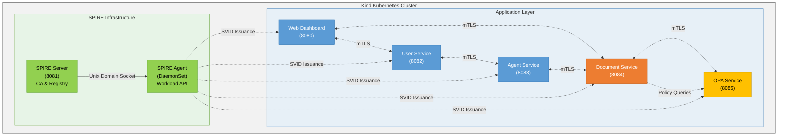

# SPIFFE/SPIRE Zero Trust Demo — Architecture

> **Note**: This document was originally written as a pre-implementation
> design blueprint. It has been updated to reflect the current state of
> the project, including the AuthBridge OIDC overlay (Phase 8),
> OpenTelemetry distributed tracing (Phase 9), and Kustomize-based
> deployment. Some sections (demo scenarios, OPA policies, educational
> features) describe the conceptual design that was implemented
> faithfully.

## Table of contents

1. [Executive summary](#executive-summary)
1. [Architecture overview](#architecture-overview)
1. [Deployment modes](#deployment-modes)
1. [Demo scenario](#demo-scenario-document-access-system)
1. [OPA policy design](#opa-policy-design)
1. [Demo flow steps](#demo-flow-steps)
1. [Component specifications](#component-specifications)
1. [Project structure](#project-structure)
1. [Deployment approach](#deployment-approach)
1. [Educational features](#educational-features)
1. [Key concepts explained](#key-concepts-explained)
1. [Implementation phases](#implementation-phases)
1. [Glossary](#glossary)

---

## Executive Summary

### Purpose

This demo application demonstrates **Zero Trust security principles** for AI agent systems using **SPIFFE/SPIRE** for workload identity and **Open Policy Agent (OPA)** for fine-grained access control. It serves as an educational companion to the `learn-oauth-go` demo, showcasing a fundamentally different security model based on cryptographic workload identity rather than bearer tokens.

### Target Audience

- **Developers** building AI agent systems who need to understand Zero Trust architecture
- **Security engineers** evaluating workload identity solutions for microservices
- **Platform engineers** implementing SPIFFE/SPIRE in Kubernetes environments
- **Anyone** interested in learning how to secure autonomous AI agents with policy-based access control

### Key Concepts Demonstrated

1. **Cryptographic Workload Identity**: SPIFFE IDs that are cryptographically verifiable, not shared secrets
2. **Workload Attestation**: Identity derived from platform metadata (Kubernetes), not configuration files
3. **Mutual TLS (mTLS) Everywhere**: All service-to-service communication uses mutual authentication
4. **Policy Composition**: Agent effective permissions = User permissions ∩ Agent capabilities
5. **Least Privilege for Agents**: AI agents operate with reduced permissions compared to delegating users
6. **Zero Trust "Never Trust, Always Verify"**: Continuous verification on every request

### What Makes This Demo Educational

Following the pattern established by `learn-oauth-go`, this demo features:

- **Color-coded console logging** (using Go's standard `log/slog`) showing identity verification, policy evaluation, and access decisions
- **Interactive web dashboard** with step-by-step flow demonstration, styled with **Red Hat Design System**
- **Red Hat branding**: Uses Red Hat fonts (Red Hat Display, Text, Mono) and official color palette
- **Visual representations** of permission matrices, policy evaluation timelines, and SVID rotation
- **Real-time mTLS handshake visualization** showing certificate exchange
- **Clear scenario outcomes** demonstrating when access is granted vs denied
- **Go best practices**: Leverages standard library (`net/http`, `log/slog`) with minimal external dependencies
- **Cobra/Viper integration**: Professional CLI with flags and configuration management

---

## Architecture Overview

### High-Level Architecture



**Legend**:
- **Green**: SPIRE Server & Agent (identity infrastructure)
- **Blue**: User/Agent Services (workload services)
- **Orange**: Document Service (protected resource)
- **Gold**: OPA Service (policy engine)
- **Solid lines**: Infrastructure connections
- **Dashed lines**: mTLS connections & SVID issuance

### Component Descriptions

#### 1. SPIRE Server (Port 8081)

**Role**: Certificate Authority and SPIFFE ID registry

**Responsibilities**:

- Issues X.509-SVIDs (SPIFFE Verifiable Identity Documents) to authenticated workloads
- Maintains registration entries mapping workload selectors to SPIFFE IDs
- Manages the trust bundle for the trust domain `spiffe://demo.example.com`
- Handles SVID rotation (short-lived certificates: 1-hour TTL)

**SPIFFE IDs Issued** (one per service, not per user/agent):

- `spiffe://demo.example.com/service/web-dashboard`
- `spiffe://demo.example.com/service/user-service`
- `spiffe://demo.example.com/service/agent-service`
- `spiffe://demo.example.com/service/document-service`
- `spiffe://demo.example.com/service/opa-service`

Users and agents are data entities within their respective services,
not separate SPIFFE identities. Each service uses its single SPIFFE
ID for all mTLS connections. User/agent identity is carried in request
bodies and headers as `spiffe://demo.example.com/user/<name>` or
`spiffe://demo.example.com/agent/<name>`, but these are logical
identifiers, not X.509-backed SVIDs.

#### 2. SPIRE Agent (DaemonSet)

**Role**: Local workload attestation and SVID delivery

**Responsibilities**:

- Attests workload identity using Kubernetes Workload Attestor (pod metadata)
- Provides Workload API via Unix Domain Socket at `/run/spire/sockets/agent.sock`
- Automatically rotates SVIDs before expiration
- Validates workload identity before issuing certificates

**Attestation**: Uses Kubernetes pod metadata (namespace, service account, labels) to verify workload identity

#### 3. Web Dashboard (Port 8080)

**Role**: Educational UI for demonstrating the demo flow

**SPIFFE ID**: `spiffe://demo.example.com/service/web-dashboard`

**Responsibilities**:

- Provides interactive UI for selecting users, agents, and documents
- Displays color-coded console output showing system activity
- Visualizes permission matrices and policy evaluation
- Supports OIDC login via Keycloak (AuthBridge overlay)
- Stores OIDC access token in session for Bearer token propagation
- Propagates Bearer token on all outbound service requests

**Technology**: Go web server, HTML/CSS/JS frontend, Server-Sent Events for real-time updates

#### 4. User Service (Port 8082)

**Role**: User management and request routing

**SPIFFE ID**: `spiffe://demo.example.com/service/user-service`

**Responsibilities**:

- Manages user data (alice, bob, carol) with department mappings
- Handles direct document access requests (user → document-service)
- Handles delegation requests (user → agent-service)
- Forwards Bearer token on the delegation path for AuthBridge
  token exchange
- Communicates with all services via mTLS (no Envoy sidecar)

**Key Feature**: On the delegation path, the user-service passes
the OIDC Bearer token through to agent-service, where the Envoy
sidecar performs token exchange on the outbound hop to
document-service.

#### 5. Agent Service (Port 8083)

**Role**: AI agent management and delegated access

**SPIFFE ID**: `spiffe://demo.example.com/service/agent-service`

**Responsibilities**:

- Manages agent data (gpt4, claude, summarizer) with capabilities
- Receives delegation requests from user-service
- Makes delegated document access requests to document-service
- Carries delegation context (which user authorized this request)
- Forwards Bearer token on outbound requests to document-service

**AuthBridge sidecar**: In the authbridge overlay, agent-service has
an Envoy sidecar with ext-proc that intercepts outbound requests to
document-service. The ext-proc performs RFC 8693 token exchange,
swapping the user's OIDC token for a document-service-scoped token.

**Key Feature**: Cannot access documents without user delegation context

#### 6. Document Service (Port 8084)

**Role**: Protected resource server with document access control

**SPIFFE ID**: `spiffe://demo.example.com/service/document-service`

**Responsibilities**:

- Serves document access requests
- Verifies caller SPIFFE ID from mTLS certificate or
  `X-SPIFFE-ID` header
- Validates JWT tokens when AuthBridge is enabled (checks issuer,
  audience, groups)
- Queries OPA for access decision on each request
- Returns document content or 403 Forbidden
- Logs access attempts with policy decision

**Documents** (by ID, not filename):

- DOC-001: Engineering Roadmap (engineering)
- DOC-002: Q4 Financial Report (finance)
- DOC-003: Admin Policies (admin)
- DOC-004: HR Guidelines (hr)
- DOC-005: Budget Projections (finance + engineering)
- DOC-006: Compliance Audit (admin + finance)
- DOC-007: All-Hands Summary (public)

#### 7. OPA Service (Port 8085)

**Role**: Centralized policy decision point

**SPIFFE ID**: `spiffe://demo.example.com/service/opa-service`

**Responsibilities**:

- Evaluates access policies written in Rego
- Receives policy queries with: caller SPIFFE ID, document ID, delegation context
- Returns allow/deny decision with detailed reasoning
- Logs all policy evaluations
- Loads policies from Kubernetes ConfigMaps

**Policy Evaluation**: Implements permission intersection: `allow if user.allow AND agent.allow`

---

## Deployment modes

The project supports multiple deployment modes via Kustomize overlays
(`deploy/k8s/overlays/`). Each overlay builds on the base manifests
and adds or modifies configuration for different environments.

### Base (mTLS only)

All services authenticate via SPIFFE mTLS. No OIDC, no Envoy
sidecars, no token exchange. This is the simplest deployment,
suitable for demonstrating SPIFFE/SPIRE and OPA without external
identity providers.

**Overlays**: `local`, `mock`, `ghcr`

### AuthBridge (mTLS + OIDC + token exchange)

Adds Keycloak for user authentication (OIDC), an Envoy sidecar on
agent-service with an ext-proc that performs RFC 8693 token exchange,
and JWT validation in document-service. This demonstrates bridging
human identity (OIDC) with workload identity (SPIFFE).

```text
┌──────────┐  OIDC  ┌──────────┐  mTLS  ┌──────────────────────┐
│ Browser  │───────▶│ Dashboard│───────▶│    User Service      │
└──────────┘        └──────────┘        └──────────┬───────────┘
                                                   │ mTLS + Bearer
                                        ┌──────────▼───────────┐
                                        │    Agent Service     │
                                        │  ┌─────────────────┐ │
                                        │  │  Envoy sidecar  │ │
                                        │  │  + ext-proc     │ │
                                        │  └────────┬────────┘ │
                                        └───────────┼──────────┘
                                                    │ token exchange
                                        ┌───────────▼──────────┐
                                        │  Document Service    │
                                        │  (JWT validation)    │
                                        └──────────┬───────────┘
                                                   │ mTLS
                                        ┌──────────▼───────────┐
                                        │    OPA Service       │
                                        └──────────────────────┘
```

**Overlays**: `authbridge`, `authbridge-remote-kc`,
`openshift-authbridge`

### OpenTelemetry

All deployment modes can optionally enable OTel distributed tracing.
When enabled, services export traces via OTLP/gRPC to an
OTel Collector, which forwards to Jaeger. The AuthBridge ext-proc
also exports `token_exchange` and `jwt_validation` spans.

**Configuration**: Set `SPIFFE_DEMO_OTEL_ENABLED=true` and
`SPIFFE_DEMO_OTEL_COLLECTOR_ENDPOINT=otel-collector:4317` via
environment variables or Kustomize patches.

### AI agents (summarizer, reviewer)

Adds real LLM-powered agent services (summarizer-service,
reviewer-service) that call external LLM APIs to process documents.

**Overlays**: `ai-agents`, `local-ai-agents`, `openshift-ai-agents`

---

## Demo scenario: document access system

### Overview

The demo simulates a document management system where:

- **Users** have department-based access rights
- **AI Agents** have capability-based restrictions
- **Delegation** requires permission intersection (user AND agent must both have access)
- **Every request** is authenticated via mTLS and authorized via OPA policies

### Users

| User  | Departments          | SPIFFE ID                              |
| ----- | -------------------- | -------------------------------------- |
| Alice | Engineering, Finance | `spiffe://demo.example.com/user/alice` |
| Bob   | Finance, Admin       | `spiffe://demo.example.com/user/bob`   |
| Carol | HR                   | `spiffe://demo.example.com/user/carol` |

### AI Agents

| Agent        | Capabilities              | SPIFFE ID                                    |
| ------------ | ------------------------- | -------------------------------------------- |
| GPT-4 Agent  | Read Engineering, Finance | `spiffe://demo.example.com/agent/gpt4`       |
| Claude Agent | Read all departments      | `spiffe://demo.example.com/agent/claude`     |
| Summarizer   | Read Finance only         | `spiffe://demo.example.com/agent/summarizer` |

### Documents

| Document              | Required Department | Sensitivity |
| --------------------- | ------------------- | ----------- |
| eng-design-doc.md     | Engineering         | Medium      |
| finance-q4-report.pdf | Finance             | High        |
| admin-credentials.txt | Admin               | Critical    |
| hr-policies.pdf       | HR                  | Medium      |
| public-readme.md      | (none)              | Public      |

### Permission Matrix

#### Direct User Access (No Agent)

|       | eng-design-doc | finance-q4-report | admin-credentials | hr-policies | public-readme |
| ----- | -------------- | ----------------- | ----------------- | ----------- | ------------- |
| Alice | ✅ Engineering  | ✅ Finance         | ❌ No Admin        | ❌ No HR     | ✅ Public      |
| Bob   | ❌ No Eng       | ✅ Finance         | ✅ Admin           | ❌ No HR     | ✅ Public      |
| Carol | ❌ No Eng       | ❌ No Finance      | ❌ No Admin        | ✅ HR        | ✅ Public      |

#### Agent Direct Access (No User Delegation)

|                  | eng-design-doc | finance-q4-report | admin-credentials | hr-policies | public-readme |
| ---------------- | -------------- | ----------------- | ----------------- | ----------- | ------------- |
| GPT-4 Agent      | ❌ No user      | ❌ No user         | ❌ No user         | ❌ No user   | ❌ No user     |
| Claude Agent     | ❌ No user      | ❌ No user         | ❌ No user         | ❌ No user   | ❌ No user     |
| Summarizer Agent | ❌ No user      | ❌ No user         | ❌ No user         | ❌ No user   | ❌ No user     |

**Key Principle**: Agents CANNOT access resources without user delegation context.

#### Delegated Access (Alice + Agent)

|                 | eng-design-doc | finance-q4-report | admin-credentials | hr-policies   | public-readme |
| --------------- | -------------- | ----------------- | ----------------- | ------------- | ------------- |
| Alice + GPT-4   | ✅ Both allow   | ✅ Both allow      | ❌ Agent lacks     | ❌ Both lack   | ✅ Both allow  |
| Alice + Claude  | ✅ Both allow   | ✅ Both allow      | ❌ Agent lacks     | ❌ Alice lacks | ✅ Both allow  |
| Alice + Summary | ❌ Agent lacks  | ✅ Both allow      | ❌ Both lack       | ❌ Both lack   | ✅ Both allow  |

#### Delegated Access (Bob + Agent)

|               | eng-design-doc | finance-q4-report | admin-credentials | hr-policies | public-readme |
| ------------- | -------------- | ----------------- | ----------------- | ----------- | ------------- |
| Bob + GPT-4   | ❌ Bob lacks    | ✅ Both allow      | ❌ Agent lacks     | ❌ Both lack | ✅ Both allow  |
| Bob + Claude  | ❌ Bob lacks    | ✅ Both allow      | ✅ Both allow      | ❌ Bob lacks | ✅ Both allow  |
| Bob + Summary | ❌ Both lack    | ✅ Both allow      | ❌ Agent lacks     | ❌ Both lack | ✅ Both allow  |

### Demonstration Scenarios

#### Scenario 1: Alice Direct Access (No Agent)

**Action**: Alice accesses `eng-design-doc.md` directly

**Expected Outcome**: ✅ **SUCCESS**

- Alice has Engineering department permissions
- Document requires Engineering
- No agent involved, so no permission intersection needed
- OPA evaluates: `user_has_department("alice", "engineering")` → true

**Console Output**:

```
🔵 [USER-SERVICE] Alice fetching SVID from SPIRE Agent...
🟢 [SPIRE-AGENT] Issued SVID: spiffe://demo.example.com/user/alice
🔵 [USER-SERVICE] Initiating mTLS connection to Document Service...
🟡 [mTLS] Handshake successful - Peer: spiffe://demo.example.com/document-service
🟣 [DOCUMENT-SERVICE] Received request for eng-design-doc.md from alice
🟠 [OPA-QUERY] Evaluating policy for user=alice, document=eng-design-doc, agent=none
🟢 [OPA-DECISION] ALLOW: User has Engineering department access
🟢 [DOCUMENT-SERVICE] Returning document content to alice
```

#### Scenario 2: GPT-4 Agent Without User Delegation

**Action**: GPT-4 Agent attempts to access `finance-q4-report.pdf` without user context

**Expected Outcome**: ❌ **DENIED**

- Agent has Finance capability
- But no user delegation context provided
- OPA policy requires user context for agent requests
- Demonstrates "agents cannot act autonomously"

**Console Output**:

```
🔵 [AGENT-SERVICE] GPT-4 Agent fetching SVID from SPIRE Agent...
🟢 [SPIRE-AGENT] Issued SVID: spiffe://demo.example.com/agent/gpt4
🔵 [AGENT-SERVICE] Initiating mTLS connection to Document Service...
🟡 [mTLS] Handshake successful - Peer: spiffe://demo.example.com/document-service
🟣 [DOCUMENT-SERVICE] Received request for finance-q4-report.pdf from agent/gpt4
🟠 [OPA-QUERY] Evaluating policy for agent=gpt4, document=finance-q4-report, user=NONE
🔴 [OPA-DECISION] DENY: Agent requests require user delegation context
🔴 [DOCUMENT-SERVICE] Access denied: 403 Forbidden
```

#### Scenario 3: Alice Delegates to GPT-4 Agent

**Action**: Alice delegates to GPT-4 Agent to access `eng-design-doc.md`

**Expected Outcome**: ✅ **SUCCESS**

- Alice has Engineering department (✓)
- GPT-4 Agent has Engineering capability (✓)
- Permission intersection: Engineering ∩ Engineering = Engineering (✓)
- Document requires Engineering (✓)
- OPA evaluates: `alice.allow AND gpt4.allow` → true

**Console Output**:

```
🔵 [USER-SERVICE] Alice initiating delegation to GPT-4 Agent...
🟢 [USER-SERVICE] Fetched SVID for alice: spiffe://demo.example.com/user/alice
🔵 [AGENT-SERVICE] GPT-4 Agent accepting delegation from alice...
🟢 [AGENT-SERVICE] Fetched SVID for gpt4: spiffe://demo.example.com/agent/gpt4
🔵 [AGENT-SERVICE] Making delegated request to Document Service...
🟡 [mTLS] Handshake successful - Peer: spiffe://demo.example.com/document-service
🟣 [DOCUMENT-SERVICE] Received delegated request:
    User: alice (spiffe://demo.example.com/user/alice)
    Agent: gpt4 (spiffe://demo.example.com/agent/gpt4)
    Document: eng-design-doc.md
🟠 [OPA-QUERY] Evaluating delegation policy...
    User permissions: [Engineering, Finance]
    Agent capabilities: [Engineering, Finance]
    Effective permissions: [Engineering, Finance]  (intersection)
    Document requirement: Engineering
🟢 [OPA-DECISION] ALLOW: Both user and agent have Engineering access
🟢 [DOCUMENT-SERVICE] Returning document content
```

#### Scenario 4: Alice + GPT-4 Agent → Admin Document

**Action**: Alice delegates to GPT-4 Agent to access `admin-credentials.txt`

**Expected Outcome**: ❌ **DENIED**

- Alice does NOT have Admin department (✗)
- GPT-4 Agent does NOT have Admin capability (✗)
- Permission intersection: {} (empty set)
- Document requires Admin
- Demonstrates "neither user nor agent has permission"

**Console Output**:

```
🔵 [USER-SERVICE] Alice initiating delegation to GPT-4 Agent...
🟢 [USER-SERVICE] Fetched SVID for alice
🔵 [AGENT-SERVICE] GPT-4 Agent accepting delegation from alice...
🟢 [AGENT-SERVICE] Fetched SVID for gpt4
🔵 [AGENT-SERVICE] Making delegated request to Document Service...
🟡 [mTLS] Handshake successful
🟣 [DOCUMENT-SERVICE] Received delegated request for admin-credentials.txt
🟠 [OPA-QUERY] Evaluating delegation policy...
    User permissions: [Engineering, Finance]
    Agent capabilities: [Engineering, Finance]
    Effective permissions: [Engineering, Finance]
    Document requirement: Admin
🔴 [OPA-DECISION] DENY: Neither user nor agent has Admin access
🔴 [DOCUMENT-SERVICE] Access denied: 403 Forbidden
```

#### Scenario 5: Bob + Summarizer Agent (Policy Reduction)

**Action**: Bob delegates to Summarizer Agent to scan all documents

**Expected Outcome**: **PARTIAL ACCESS** (policy reduction demonstration)

- Bob has Finance + Admin departments (2 departments)
- Summarizer Agent has Finance capability only (1 department)
- Permission intersection: Finance only
- Bob could access 3 documents alone, but Summarizer reduces this to 1 document
- Demonstrates "agent acts as capability limiter"

**Console Output**:

```
🔵 [USER-SERVICE] Bob initiating delegation to Summarizer Agent...
🟢 [USER-SERVICE] Bob's permissions: [Finance, Admin] → Could access 3 documents alone
🔵 [AGENT-SERVICE] Summarizer Agent accepting delegation from Bob...
🟢 [AGENT-SERVICE] Summarizer capabilities: [Finance] → More restrictive
🟠 [OPA-QUERY] Permission intersection: [Finance, Admin] ∩ [Finance] = [Finance]
🔵 [AGENT-SERVICE] Scanning documents...

📄 Checking eng-design-doc.md...
🔴 DENY: Effective permissions [Finance] lacks Engineering

📄 Checking finance-q4-report.pdf...
🟢 ALLOW: Effective permissions [Finance] includes Finance

📄 Checking admin-credentials.txt...
🔴 DENY: Effective permissions [Finance] lacks Admin (even though Bob has it!)

📄 Checking hr-policies.pdf...
🔴 DENY: Effective permissions [Finance] lacks HR

📄 Checking public-readme.md...
🟢 ALLOW: Public document

🟡 [SUMMARY] Agent accessed 2/5 documents (vs Bob's 4/5 direct access)
🟡 [PRINCIPLE] Agent capabilities REDUCE effective permissions (Least Privilege)
```

---

## OPA Policy Design

### Policy Structure

The demo uses three main policy modules that work together:

1. **`user_permissions.rego`** - Defines which departments each user belongs to
2. **`agent_capabilities.rego`** - Defines which document types each agent can access
3. **`document_access.rego`** - Main authorization logic implementing permission intersection

### Policy Evaluation Flow

```
┌─────────────────────────────────────────────────────────────────┐
│                    Document Service Request                     │
│  Input: {caller_spiffe_id, document_id, delegation_context}     │
└────────────────────────────┬────────────────────────────────────┘
                             │
                             ▼
┌─────────────────────────────────────────────────────────────────┐
│                     OPA Policy Evaluation                       │
│                                                                 │
│  Step 1: Parse SPIFFE ID                                        │
│  ├─ Extract: spiffe://demo.example.com/{type}/{name}            │
│  └─ Determine if caller is user, agent, or other                │
│                                                                 │
│  Step 2: Load Document Requirements                             │
│  └─ Query: documents[document_id].required_department           │
│                                                                 │
│  Step 3: Check Request Type                                     │
│  ├─ Direct User Request? → Evaluate user_permissions            │
│  ├─ Direct Agent Request? → DENY (no user context)              │
│  └─ Delegated Request? → Evaluate permission intersection       │
│                                                                 │
│  Step 4: Permission Intersection (Delegation)                   │
│  ├─ User departments: user_permissions[user]                    │
│  ├─ Agent capabilities: agent_capabilities[agent]               │
│  ├─ Intersection: user_deps ∩ agent_caps                        │
│  └─ Required: document.required_department                      │
│                                                                 │
│  Step 5: Authorization Decision                                 │
│  └─ ALLOW if required_department ∈ intersection                 │
└────────────────────────────┬────────────────────────────────────┘
                             │
                             ▼
┌─────────────────────────────────────────────────────────────────┐
│                    Return Decision + Reason                     │
│  Output: {allow: true/false, reason: "...", details: {...}}     │
└─────────────────────────────────────────────────────────────────┘
```

### Policy Module 1: User Permissions

**File**: `policies/user_permissions.rego`

```rego
package demo.users

# User-to-department mappings
# In production, this would come from an identity provider (LDAP, AD, OIDC claims)

user_departments := {
    "alice": ["engineering", "finance"],
    "bob": ["finance", "admin"],
    "carol": ["hr"]
}

# Helper rule: Check if a user belongs to a specific department
has_department(user_name, department) {
    department_list := user_departments[user_name]
    department in department_list
}

# Helper rule: Get all departments for a user
get_departments(user_name) = departments {
    departments := user_departments[user_name]
}

# Default: unknown users have no departments
get_departments(user_name) = [] {
    not user_departments[user_name]
}
```

### Policy Module 2: Agent Capabilities

**File**: `policies/agent_capabilities.rego`

```rego
package demo.agents

# Agent capability mappings
# Defines which document types/departments each agent can access
# These represent the MAXIMUM capabilities of the agent
# Actual access is further restricted by user permissions via intersection

agent_capabilities := {
    "gpt4": ["engineering", "finance"],
    "claude": ["engineering", "finance", "admin", "hr"],  # Unrestricted agent
    "summarizer": ["finance"]  # Highly restricted agent
}

# Helper rule: Check if an agent has a specific capability
has_capability(agent_name, department) {
    capability_list := agent_capabilities[agent_name]
    department in capability_list
}

# Helper rule: Get all capabilities for an agent
get_capabilities(agent_name) = capabilities {
    capabilities := agent_capabilities[agent_name]
}

# Default: unknown agents have no capabilities
get_capabilities(agent_name) = [] {
    not agent_capabilities[agent_name]
}
```

### Policy Module 3: Document Access (Main Authorization Logic)

**File**: `policies/document_access.rego`

```rego
package demo.authorization

import data.demo.users
import data.demo.agents
import future.keywords.in

# Document metadata
documents := {
    "eng-design-doc.md": {
        "required_department": "engineering",
        "sensitivity": "medium"
    },
    "finance-q4-report.pdf": {
        "required_department": "finance",
        "sensitivity": "high"
    },
    "admin-credentials.txt": {
        "required_department": "admin",
        "sensitivity": "critical"
    },
    "hr-policies.pdf": {
        "required_department": "hr",
        "sensitivity": "medium"
    },
    "public-readme.md": {
        "required_department": "",  # No requirement
        "sensitivity": "public"
    }
}

# Parse SPIFFE ID to extract type and name
# Example: spiffe://demo.example.com/user/alice → {type: "user", name: "alice"}
parse_spiffe_id(spiffe_id) = result {
    # Split by "/" and take last two parts
    parts := split(spiffe_id, "/")
    count(parts) >= 2
    result := {
        "type": parts[count(parts) - 2],
        "name": parts[count(parts) - 1]
    }
}

# MAIN DECISION RULE: Allow access based on request type

default allow = false

# Rule 1: Public documents are always accessible
allow {
    document := documents[input.document_id]
    document.required_department == ""
}

# Rule 2: Direct user access (no agent delegation)
allow {
    # No delegation context provided
    not input.delegation

    # Parse caller SPIFFE ID
    caller := parse_spiffe_id(input.caller_spiffe_id)
    caller.type == "user"

    # Get document requirement
    document := documents[input.document_id]
    required_dept := document.required_department

    # Check if user has the required department
    users.has_department(caller.name, required_dept)
}

# Rule 3: Agent requests without user delegation are DENIED
# This is implicitly handled by default allow = false
# but we make it explicit for educational purposes
deny_reason := "Agent requests require user delegation context" {
    not input.delegation
    caller := parse_spiffe_id(input.caller_spiffe_id)
    caller.type == "agent"
}

# Rule 4: Delegated access (user delegates to agent)
allow {
    # Delegation context is provided
    input.delegation

    # Parse identities
    user := parse_spiffe_id(input.delegation.user_spiffe_id)
    agent := parse_spiffe_id(input.delegation.agent_spiffe_id)

    user.type == "user"
    agent.type == "agent"

    # Get document requirement
    document := documents[input.document_id]
    required_dept := document.required_department

    # Get user departments
    user_depts := users.get_departments(user.name)

    # Get agent capabilities
    agent_caps := agents.get_capabilities(agent.name)

    # Compute intersection (effective permissions)
    effective_permissions := user_depts & agent_caps

    # Check if required department is in effective permissions
    required_dept in effective_permissions
}

# Helper rule: Compute effective permissions for delegation
effective_permissions = result {
    input.delegation
    user := parse_spiffe_id(input.delegation.user_spiffe_id)
    agent := parse_spiffe_id(input.delegation.agent_spiffe_id)

    user_depts := users.get_departments(user.name)
    agent_caps := agents.get_capabilities(agent.name)

    result := user_depts & agent_caps
}

# Detailed decision with reasoning (used for logging/debugging)
decision := {
    "allow": allow,
    "reason": reason,
    "details": details
}

reason := "Public document accessible to all" {
    allow
    document := documents[input.document_id]
    document.required_department == ""
}

reason := "User has required department access" {
    allow
    not input.delegation
    caller := parse_spiffe_id(input.caller_spiffe_id)
    caller.type == "user"
}

reason := "Both user and agent have required access (delegation)" {
    allow
    input.delegation
}

reason := deny_reason {
    not allow
    deny_reason
}

reason := "Insufficient permissions" {
    not allow
    not deny_reason
}

details := {
    "document_id": input.document_id,
    "required_department": documents[input.document_id].required_department,
    "caller_type": parse_spiffe_id(input.caller_spiffe_id).type,
    "caller_name": parse_spiffe_id(input.caller_spiffe_id).name
}

details := {
    "document_id": input.document_id,
    "required_department": documents[input.document_id].required_department,
    "user": parse_spiffe_id(input.delegation.user_spiffe_id).name,
    "agent": parse_spiffe_id(input.delegation.agent_spiffe_id).name,
    "user_departments": users.get_departments(parse_spiffe_id(input.delegation.user_spiffe_id).name),
    "agent_capabilities": agents.get_capabilities(parse_spiffe_id(input.delegation.agent_spiffe_id).name),
    "effective_permissions": effective_permissions
} {
    input.delegation
}
```

### Example OPA Input/Output

#### Example 1: Alice Direct Access to Engineering Doc

**Input**:

```json
{
  "caller_spiffe_id": "spiffe://demo.example.com/user/alice",
  "document_id": "eng-design-doc.md",
  "delegation": null
}
```

**Output**:

```json
{
  "allow": true,
  "reason": "User has required department access",
  "details": {
    "document_id": "eng-design-doc.md",
    "required_department": "engineering",
    "caller_type": "user",
    "caller_name": "alice"
  }
}
```

#### Example 2: GPT-4 Agent Without Delegation

**Input**:

```json
{
  "caller_spiffe_id": "spiffe://demo.example.com/agent/gpt4",
  "document_id": "finance-q4-report.pdf",
  "delegation": null
}
```

**Output**:

```json
{
  "allow": false,
  "reason": "Agent requests require user delegation context",
  "details": {
    "document_id": "finance-q4-report.pdf",
    "required_department": "finance",
    "caller_type": "agent",
    "caller_name": "gpt4"
  }
}
```

#### Example 3: Alice Delegates to GPT-4 for Engineering Doc

**Input**:

```json
{
  "caller_spiffe_id": "spiffe://demo.example.com/agent/gpt4",
  "document_id": "eng-design-doc.md",
  "delegation": {
    "user_spiffe_id": "spiffe://demo.example.com/user/alice",
    "agent_spiffe_id": "spiffe://demo.example.com/agent/gpt4"
  }
}
```

**Output**:

```json
{
  "allow": true,
  "reason": "Both user and agent have required access (delegation)",
  "details": {
    "document_id": "eng-design-doc.md",
    "required_department": "engineering",
    "user": "alice",
    "agent": "gpt4",
    "user_departments": ["engineering", "finance"],
    "agent_capabilities": ["engineering", "finance"],
    "effective_permissions": ["engineering", "finance"]
  }
}
```

#### Example 4: Bob + Summarizer → Admin Doc (Shows Reduction)

**Input**:

```json
{
  "caller_spiffe_id": "spiffe://demo.example.com/agent/summarizer",
  "document_id": "admin-credentials.txt",
  "delegation": {
    "user_spiffe_id": "spiffe://demo.example.com/user/bob",
    "agent_spiffe_id": "spiffe://demo.example.com/agent/summarizer"
  }
}
```

**Output**:

```json
{
  "allow": false,
  "reason": "Insufficient permissions",
  "details": {
    "document_id": "admin-credentials.txt",
    "required_department": "admin",
    "user": "bob",
    "agent": "summarizer",
    "user_departments": ["finance", "admin"],
    "agent_capabilities": ["finance"],
    "effective_permissions": ["finance"]
  }
}
```

**Key Observation**: Even though Bob has `admin` department access, the Summarizer agent only has `finance` capability. The intersection is `["finance"]`, which doesn't include `admin`, so access is denied. This demonstrates **permission reduction** through delegation.

### Policy Testing

The demo includes OPA policy tests to verify correct behavior:

**File**: `policies/document_access_test.rego`

```rego
package demo.authorization

# Test: Public documents are always accessible
test_public_document_access {
    allow with input as {
        "caller_spiffe_id": "spiffe://demo.example.com/user/alice",
        "document_id": "public-readme.md",
        "delegation": null
    }
}

# Test: User with correct department can access
test_user_direct_access_allowed {
    allow with input as {
        "caller_spiffe_id": "spiffe://demo.example.com/user/alice",
        "document_id": "eng-design-doc.md",
        "delegation": null
    }
}

# Test: User without correct department cannot access
test_user_direct_access_denied {
    not allow with input as {
        "caller_spiffe_id": "spiffe://demo.example.com/user/alice",
        "document_id": "admin-credentials.txt",
        "delegation": null
    }
}

# Test: Agent without user delegation is denied
test_agent_without_delegation_denied {
    not allow with input as {
        "caller_spiffe_id": "spiffe://demo.example.com/agent/gpt4",
        "document_id": "finance-q4-report.pdf",
        "delegation": null
    }
}

# Test: Delegation with both having access succeeds
test_delegation_both_allowed {
    allow with input as {
        "caller_spiffe_id": "spiffe://demo.example.com/agent/gpt4",
        "document_id": "eng-design-doc.md",
        "delegation": {
            "user_spiffe_id": "spiffe://demo.example.com/user/alice",
            "agent_spiffe_id": "spiffe://demo.example.com/agent/gpt4"
        }
    }
}

# Test: Delegation fails when agent lacks capability
test_delegation_agent_lacks_capability {
    not allow with input as {
        "caller_spiffe_id": "spiffe://demo.example.com/agent/summarizer",
        "document_id": "admin-credentials.txt",
        "delegation": {
            "user_spiffe_id": "spiffe://demo.example.com/user/bob",
            "agent_spiffe_id": "spiffe://demo.example.com/agent/summarizer"
        }
    }
}

# Test: Permission intersection calculation
test_effective_permissions_intersection {
    effective_permissions == ["finance"] with input as {
        "delegation": {
            "user_spiffe_id": "spiffe://demo.example.com/user/bob",
            "agent_spiffe_id": "spiffe://demo.example.com/agent/summarizer"
        }
    }
}
```

Run tests with: `opa test policies/`

---

## Demo Flow Steps

### Web Dashboard Interface

The Web Dashboard (accessible at `http://localhost:8080`) provides an interactive UI for demonstrating the Zero Trust access control flow. The interface is divided into three main sections:

1. **Control Panel** (top) - User selects user, agent (optional), and document
2. **Console Output** (middle) - Real-time color-coded logs showing system activity
3. **Visual Panel** (bottom) - Permission matrix, policy evaluation, SVID details

### Interactive Demo Steps

#### Step 1: SPIRE Setup and Workload Attestation

**User Action**: Click "Initialize SPIRE Infrastructure"

**System Response**:

```
🟢 [SPIRE-SERVER] Starting SPIRE Server...
🟢 [SPIRE-SERVER] Listening on localhost:8081
🟢 [SPIRE-SERVER] Trust domain: spiffe://demo.example.com
🟢 [SPIRE-SERVER] Loading registration entries...

📝 Registered workload: web-dashboard
   SPIFFE ID: spiffe://demo.example.com/web-dashboard
   Selector: k8s:ns:spiffe-demo, k8s:sa:web-dashboard

📝 Registered workload: user/alice
   SPIFFE ID: spiffe://demo.example.com/user/alice
   Selector: k8s:ns:spiffe-demo, k8s:sa:user-alice, k8s:pod-label:user:alice

📝 Registered workload: agent/gpt4
   SPIFFE ID: spiffe://demo.example.com/agent/gpt4
   Selector: k8s:ns:spiffe-demo, k8s:sa:agent-gpt4, k8s:pod-label:agent:gpt4

📝 Registered workload: document-service
   SPIFFE ID: spiffe://demo.example.com/document-service
   Selector: k8s:ns:spiffe-demo, k8s:sa:document-service

📝 Registered workload: opa-service
   SPIFFE ID: spiffe://demo.example.com/opa-service
   Selector: k8s:ns:spiffe-demo, k8s:sa:opa-service

🟢 [SPIRE-AGENT] Starting SPIRE Agent DaemonSet...
🟢 [SPIRE-AGENT] Connected to SPIRE Server at localhost:8081
🟢 [SPIRE-AGENT] Workload API listening on /run/spire/sockets/agent.sock
🟢 [SPIRE-AGENT] Ready to attest workloads and issue SVIDs

🟣 [OPA-SERVICE] Loading policies...
🟣 [OPA-SERVICE] Loaded: user_permissions.rego
🟣 [OPA-SERVICE] Loaded: agent_capabilities.rego
🟣 [OPA-SERVICE] Loaded: document_access.rego
🟣 [OPA-SERVICE] Policy evaluation endpoint ready at :8085/v1/data/demo/authorization/decision

✅ Infrastructure Ready
```

**Visual Panel**:

- Shows SPIRE trust domain tree with all registered identities
- SVID rotation timer: "Next rotation in 58:32"
- Policy modules loaded: 3/3

#### Step 2: Direct User Access (Alice → Engineering Doc)

**User Action**:

1. Select User: "Alice (Engineering, Finance)"
2. Select Agent: "(None - Direct Access)"
3. Select Document: "eng-design-doc.md"
4. Click "Access Document"

**System Response**:

```
━━━━━━━━━━━━━━━━━━━━━━━━━━━━━━━━━━━━━━━━━━━━━━━━━━━━━━━━━━
 STEP 1: WORKLOAD IDENTITY ATTESTATION
━━━━━━━━━━━━━━━━━━━━━━━━━━━━━━━━━━━━━━━━━━━━━━━━━━━━━━━━━━

🔵 [USER-SERVICE] Workload requesting identity from SPIRE Agent...
🔵 [USER-SERVICE] Connecting to Workload API: unix:///run/spire/sockets/agent.sock

🟢 [SPIRE-AGENT] Received attestation request
🟢 [SPIRE-AGENT] Checking pod metadata...
    Namespace: spiffe-demo
    Service Account: user-alice
    Pod Label: user=alice
🟢 [SPIRE-AGENT] Matched registration entry: user/alice
🟢 [SPIRE-AGENT] Issuing X.509-SVID...

📜 [SVID ISSUED]
   SPIFFE ID: spiffe://demo.example.com/user/alice
   Serial Number: 7c:3a:9b:2f:e1:45:8a:c3
   Not Before: 2026-01-20 14:30:00 UTC
   Not After:  2026-01-20 15:30:00 UTC (60 minute TTL)
   Subject: O=SPIRE, CN=user/alice

━━━━━━━━━━━━━━━━━━━━━━━━━━━━━━━━━━━━━━━━━━━━━━━━━━━━━━━━━━
 STEP 2: mTLS CONNECTION TO DOCUMENT SERVICE
━━━━━━━━━━━━━━━━━━━━━━━━━━━━━━━━━━━━━━━━━━━━━━━━━━━━━━━━━━

🔵 [USER-SERVICE] Initiating mTLS connection to document-service:8084
🔵 [USER-SERVICE] Client certificate: spiffe://demo.example.com/user/alice

🟡 [mTLS-HANDSHAKE] ClientHello sent
🟡 [mTLS-HANDSHAKE] ServerHello received from spiffe://demo.example.com/document-service
🟡 [mTLS-HANDSHAKE] Server certificate validated against SPIRE trust bundle
🟡 [mTLS-HANDSHAKE] Client certificate sent for mutual authentication
🟡 [mTLS-HANDSHAKE] Handshake complete - TLS 1.3, ECDHE-RSA-AES256-GCM-SHA384

✅ [mTLS] Secure connection established
   Client: spiffe://demo.example.com/user/alice
   Server: spiffe://demo.example.com/document-service

━━━━━━━━━━━━━━━━━━━━━━━━━━━━━━━━━━━━━━━━━━━━━━━━━━━━━━━━━━
 STEP 3: AUTHORIZATION POLICY EVALUATION
━━━━━━━━━━━━━━━━━━━━━━━━━━━━━━━━━━━━━━━━━━━━━━━━━━━━━━━━━━

🟣 [DOCUMENT-SERVICE] Received request for: eng-design-doc.md
🟣 [DOCUMENT-SERVICE] Caller SPIFFE ID: spiffe://demo.example.com/user/alice
🟣 [DOCUMENT-SERVICE] Request type: DIRECT USER ACCESS (no delegation)

🟠 [OPA-QUERY] POST /v1/data/demo/authorization/decision
{
  "input": {
    "caller_spiffe_id": "spiffe://demo.example.com/user/alice",
    "document_id": "eng-design-doc.md",
    "delegation": null
  }
}

🟠 [OPA-EVAL] Evaluating policy: document_access.rego
🟠 [OPA-EVAL] Parsed SPIFFE ID: type=user, name=alice
🟠 [OPA-EVAL] Document requirement: engineering
🟠 [OPA-EVAL] User departments: [engineering, finance]
🟠 [OPA-EVAL] Rule matched: allow (user has required department)

🟢 [OPA-DECISION] ✅ ALLOW
{
  "allow": true,
  "reason": "User has required department access",
  "details": {
    "document_id": "eng-design-doc.md",
    "required_department": "engineering",
    "caller_type": "user",
    "caller_name": "alice",
    "user_departments": ["engineering", "finance"]
  }
}

━━━━━━━━━━━━━━━━━━━━━━━━━━━━━━━━━━━━━━━━━━━━━━━━━━━━━━━━━━
 STEP 4: DOCUMENT ACCESS
━━━━━━━━━━━━━━━━━━━━━━━━━━━━━━━━━━━━━━━━━━━━━━━━━━━━━━━━━━

🟢 [DOCUMENT-SERVICE] Authorization successful - returning document
🟢 [DOCUMENT-SERVICE] HTTP 200 OK
   Content-Type: text/markdown
   Content-Length: 1547 bytes

📄 [DOCUMENT CONTENT]
# Engineering Design Document
## Architecture Overview
...

✅ Access Granted
```

**Visual Panel**:

- Permission Matrix:

  ```
  User: Alice       [Engineering ✓] [Finance ✓]
  Agent: (none)     N/A
  Effective:        [Engineering ✓] [Finance ✓]
  Required:         [Engineering ✓]
  Decision:         ✅ ALLOW
  ```

- Policy Evaluation Timeline:

  ```
  0ms   - Request received
  2ms   - SPIFFE ID parsed
  3ms   - Document requirement loaded
  5ms   - User permissions checked
  6ms   - Decision: ALLOW
  ```

#### Step 3: Agent Without Delegation (Demonstrates Denial)

**User Action**:

1. Select User: "(None - Agent Only)"
2. Select Agent: "GPT-4 Agent (Engineering, Finance)"
3. Select Document: "finance-q4-report.pdf"
4. Click "Access Document"

**System Response**:

```
━━━━━━━━━━━━━━━━━━━━━━━━━━━━━━━━━━━━━━━━━━━━━━━━━━━━━━━━━━
 STEP 1: WORKLOAD IDENTITY ATTESTATION
━━━━━━━━━━━━━━━━━━━━━━━━━━━━━━━━━━━━━━━━━━━━━━━━━━━━━━━━━━

🔵 [AGENT-SERVICE] Workload requesting identity from SPIRE Agent...

🟢 [SPIRE-AGENT] Received attestation request
🟢 [SPIRE-AGENT] Checking pod metadata...
    Namespace: spiffe-demo
    Service Account: agent-gpt4
    Pod Label: agent=gpt4
🟢 [SPIRE-AGENT] Matched registration entry: agent/gpt4
🟢 [SPIRE-AGENT] Issuing X.509-SVID...

📜 [SVID ISSUED]
   SPIFFE ID: spiffe://demo.example.com/agent/gpt4
   Serial Number: 9f:2d:7a:1b:c4:56:3e:88
   Not Before: 2026-01-20 14:30:05 UTC
   Not After:  2026-01-20 15:30:05 UTC (60 minute TTL)

━━━━━━━━━━━━━━━━━━━━━━━━━━━━━━━━━━━━━━━━━━━━━━━━━━━━━━━━━━
 STEP 2: mTLS CONNECTION TO DOCUMENT SERVICE
━━━━━━━━━━━━━━━━━━━━━━━━━━━━━━━━━━━━━━━━━━━━━━━━━━━━━━━━━━

🔵 [AGENT-SERVICE] Initiating mTLS connection to document-service:8084
🟡 [mTLS-HANDSHAKE] Handshake complete

✅ [mTLS] Secure connection established
   Client: spiffe://demo.example.com/agent/gpt4
   Server: spiffe://demo.example.com/document-service

━━━━━━━━━━━━━━━━━━━━━━━━━━━━━━━━━━━━━━━━━━━━━━━━━━━━━━━━━━
 STEP 3: AUTHORIZATION POLICY EVALUATION
━━━━━━━━━━━━━━━━━━━━━━━━━━━━━━━━━━━━━━━━━━━━━━━━━━━━━━━━━━

🟣 [DOCUMENT-SERVICE] Received request for: finance-q4-report.pdf
🟣 [DOCUMENT-SERVICE] Caller SPIFFE ID: spiffe://demo.example.com/agent/gpt4
🟣 [DOCUMENT-SERVICE] Request type: AGENT WITHOUT DELEGATION ⚠️

🟠 [OPA-QUERY] POST /v1/data/demo/authorization/decision
{
  "input": {
    "caller_spiffe_id": "spiffe://demo.example.com/agent/gpt4",
    "document_id": "finance-q4-report.pdf",
    "delegation": null
  }
}

🟠 [OPA-EVAL] Evaluating policy: document_access.rego
🟠 [OPA-EVAL] Parsed SPIFFE ID: type=agent, name=gpt4
🟠 [OPA-EVAL] Agent capabilities: [engineering, finance]
🟠 [OPA-EVAL] ⚠️  No user delegation context provided
🟠 [OPA-EVAL] Rule matched: deny_reason (agent requires user delegation)

🔴 [OPA-DECISION] ❌ DENY
{
  "allow": false,
  "reason": "Agent requests require user delegation context",
  "details": {
    "document_id": "finance-q4-report.pdf",
    "required_department": "finance",
    "caller_type": "agent",
    "caller_name": "gpt4"
  }
}

━━━━━━━━━━━━━━━━━━━━━━━━━━━━━━━━━━━━━━━━━━━━━━━━━━━━━━━━━━
 STEP 4: DOCUMENT ACCESS
━━━━━━━━━━━━━━━━━━━━━━━━━━━━━━━━━━━━━━━━━━━━━━━━━━━━━━━━━━

🔴 [DOCUMENT-SERVICE] Authorization failed
🔴 [DOCUMENT-SERVICE] HTTP 403 Forbidden

❌ Access Denied

💡 ZERO TRUST PRINCIPLE: AI agents CANNOT access resources autonomously.
   They must operate within the context of a delegating user.
```

**Visual Panel**:

- Permission Matrix:

  ```
  User: (none)      N/A
  Agent: GPT-4      [Engineering ✓] [Finance ✓]
  Effective:        ❌ NO USER CONTEXT
  Required:         [Finance ✓]
  Decision:         ❌ DENY - No delegation
  ```

- Highlighted Message:

  ```
  ⚠️  POLICY ENFORCEMENT
  Agents cannot act autonomously in a Zero Trust architecture.
  Every agent action must be authorized by a user delegation.
  ```

#### Step 4: User Delegates to Agent (Alice + GPT-4 → Engineering Doc)

**User Action**:

1. Select User: "Alice (Engineering, Finance)"
2. Select Agent: "GPT-4 Agent (Engineering, Finance)"
3. Select Document: "eng-design-doc.md"
4. Click "Delegate and Access"

**System Response**:

```
━━━━━━━━━━━━━━━━━━━━━━━━━━━━━━━━━━━━━━━━━━━━━━━━━━━━━━━━━━
 DELEGATED ACCESS FLOW
━━━━━━━━━━━━━━━━━━━━━━━━━━━━━━━━━━━━━━━━━━━━━━━━━━━━━━━━━━

🔵 [USER-SERVICE] Alice initiating delegation to GPT-4 Agent
🔵 [USER-SERVICE] Fetching user SVID...

🟢 [SPIRE-AGENT] Issued SVID: spiffe://demo.example.com/user/alice

🔵 [USER-SERVICE] → AGENT-SERVICE: Delegation request
   User: alice
   Task: "Access eng-design-doc.md"
   Authorization: Delegation token signed by alice

🔵 [AGENT-SERVICE] Received delegation from Alice
🔵 [AGENT-SERVICE] Fetching agent SVID...

🟢 [SPIRE-AGENT] Issued SVID: spiffe://demo.example.com/agent/gpt4

━━━━━━━━━━━━━━━━━━━━━━━━━━━━━━━━━━━━━━━━━━━━━━━━━━━━━━━━━━
 mTLS CONNECTION WITH DELEGATION CONTEXT
━━━━━━━━━━━━━━━━━━━━━━━━━━━━━━━━━━━━━━━━━━━━━━━━━━━━━━━━━━

🔵 [AGENT-SERVICE] Initiating mTLS connection to document-service:8084
🟡 [mTLS-HANDSHAKE] Handshake complete

✅ [mTLS] Secure connection established
   Client: spiffe://demo.example.com/agent/gpt4
   Server: spiffe://demo.example.com/document-service

━━━━━━━━━━━━━━━━━━━━━━━━━━━━━━━━━━━━━━━━━━━━━━━━━━━━━━━━━━
 POLICY EVALUATION WITH PERMISSION INTERSECTION
━━━━━━━━━━━━━━━━━━━━━━━━━━━━━━━━━━━━━━━━━━━━━━━━━━━━━━━━━━

🟣 [DOCUMENT-SERVICE] Received DELEGATED request
   Caller: spiffe://demo.example.com/agent/gpt4
   Delegating User: spiffe://demo.example.com/user/alice
   Document: eng-design-doc.md

🟠 [OPA-QUERY] POST /v1/data/demo/authorization/decision
{
  "input": {
    "caller_spiffe_id": "spiffe://demo.example.com/agent/gpt4",
    "document_id": "eng-design-doc.md",
    "delegation": {
      "user_spiffe_id": "spiffe://demo.example.com/user/alice",
      "agent_spiffe_id": "spiffe://demo.example.com/agent/gpt4"
    }
  }
}

🟠 [OPA-EVAL] Evaluating delegation policy...
🟠 [OPA-EVAL] User: alice
   User departments: [engineering, finance]

🟠 [OPA-EVAL] Agent: gpt4
   Agent capabilities: [engineering, finance]

🟠 [OPA-EVAL] Computing permission intersection...
   [engineering, finance] ∩ [engineering, finance] = [engineering, finance]

🟠 [OPA-EVAL] Document requirement: engineering
🟠 [OPA-EVAL] Is 'engineering' in [engineering, finance]? YES ✓

🟢 [OPA-DECISION] ✅ ALLOW
{
  "allow": true,
  "reason": "Both user and agent have required access (delegation)",
  "details": {
    "document_id": "eng-design-doc.md",
    "required_department": "engineering",
    "user": "alice",
    "agent": "gpt4",
    "user_departments": ["engineering", "finance"],
    "agent_capabilities": ["engineering", "finance"],
    "effective_permissions": ["engineering", "finance"]
  }
}

━━━━━━━━━━━━━━━━━━━━━━━━━━━━━━━━━━━━━━━━━━━━━━━━━━━━━━━━━━
 DOCUMENT ACCESS
━━━━━━━━━━━━━━━━━━━━━━━━━━━━━━━━━━━━━━━━━━━━━━━━━━━━━━━━━━

🟢 [DOCUMENT-SERVICE] Authorization successful
🟢 [DOCUMENT-SERVICE] Returning document to agent/gpt4 on behalf of alice

📄 [DOCUMENT CONTENT DELIVERED TO AGENT]

✅ Delegated Access Successful

💡 PERMISSION INTERSECTION: Both Alice and GPT-4 have Engineering access.
   Effective permissions = User ∩ Agent = [Engineering, Finance]
```

**Visual Panel**:

- Permission Venn Diagram:

  ```
        Alice                    GPT-4
   ┌─────────────────┐    ┌──────────────────┐
   │  Engineering    │    │   Engineering    │
   │  Finance        │    │   Finance        │
   └─────────────────┘    └──────────────────┘
            │                      │
            └──────────┬───────────┘
                       │
            Effective Permissions
           ┌───────────▼──────────┐
           │  Engineering         │
           │  Finance             │
           └──────────────────────┘
                       │
                  Required: Engineering ✓
                  Decision: ✅ ALLOW
  ```

#### Step 5: Permission Reduction (Bob + Summarizer → Admin Doc)

**User Action**:

1. Select User: "Bob (Finance, Admin)"
2. Select Agent: "Summarizer Agent (Finance only)"
3. Select Document: "admin-credentials.txt"
4. Click "Delegate and Access"

**System Response**:

```
━━━━━━━━━━━━━━━━━━━━━━━━━━━━━━━━━━━━━━━━━━━━━━━━━━━━━━━━━━
 DELEGATED ACCESS FLOW (PERMISSION REDUCTION DEMO)
━━━━━━━━━━━━━━━━━━━━━━━━━━━━━━━━━━━━━━━━━━━━━━━━━━━━━━━━━━

[... SVID issuance and mTLS handshake ...]

━━━━━━━━━━━━━━━━━━━━━━━━━━━━━━━━━━━━━━━━━━━━━━━━━━━━━━━━━━
 POLICY EVALUATION WITH PERMISSION INTERSECTION
━━━━━━━━━━━━━━━━━━━━━━━━━━━━━━━━━━━━━━━━━━━━━━━━━━━━━━━━━━

🟠 [OPA-EVAL] User: bob
   User departments: [finance, admin]  ← Bob HAS admin access

🟠 [OPA-EVAL] Agent: summarizer
   Agent capabilities: [finance]  ← Summarizer does NOT have admin capability

🟠 [OPA-EVAL] Computing permission intersection...
   [finance, admin] ∩ [finance] = [finance]  ← 'admin' is REMOVED!

🟠 [OPA-EVAL] Document requirement: admin
🟠 [OPA-EVAL] Is 'admin' in [finance]? NO ✗

🔴 [OPA-DECISION] ❌ DENY
{
  "allow": false,
  "reason": "Insufficient permissions",
  "details": {
    "document_id": "admin-credentials.txt",
    "required_department": "admin",
    "user": "bob",
    "agent": "summarizer",
    "user_departments": ["finance", "admin"],
    "agent_capabilities": ["finance"],
    "effective_permissions": ["finance"]  ← Only finance remains!
  }
}

━━━━━━━━━━━━━━━━━━━━━━━━━━━━━━━━━━━━━━━━━━━━━━━━━━━━━━━━━━
 ACCESS DENIED
━━━━━━━━━━━━━━━━━━━━━━━━━━━━━━━━━━━━━━━━━━━━━━━━━━━━━━━━━━

🔴 [DOCUMENT-SERVICE] Authorization failed
🔴 [DOCUMENT-SERVICE] HTTP 403 Forbidden

❌ Access Denied

💡 LEAST PRIVILEGE PRINCIPLE:
   Bob has 'admin' access directly, but the Summarizer agent does not.
   When Bob delegates to Summarizer, the effective permissions are REDUCED
   to only what the agent is capable of ([finance]).

   This demonstrates that agents act as CAPABILITY LIMITERS, enforcing
   least privilege even when users have broader permissions.

   Bob alone:         [finance, admin] → Could access admin-credentials.txt
   Bob + Summarizer:  [finance]        → Cannot access admin-credentials.txt
```

**Visual Panel**:

- Permission Venn Diagram showing NON-OVERLAPPING sets:

  ```
         Bob                   Summarizer
   ┌──────────────┐         ┌──────────────┐
   │ Finance      │         │ Finance      │
   │ Admin        │         └──────────────┘
   └──────────────┘
         │                        │
         └────────────┬───────────┘
                      │
           Intersection (Effective)
          ┌───────────▼──────────┐
          │  Finance  only       │
          └──────────────────────┘
                      │
                 Required: Admin ✗
                 Decision: ❌ DENY
  ```

- Comparison Table:

  ```
  ┌────────────────────────────────────────────────────────────┐
  │ Access Comparison: Bob Direct vs Bob + Summarizer          │
  ├────────────────────┬──────────────┬────────────────────────┤
  │ Document           │ Bob Direct   │ Bob + Summarizer       │
  ├────────────────────┼──────────────┼────────────────────────┤
  │ eng-design-doc     │ ❌ No Eng     │ ❌ Neither has Eng      │
  │ finance-q4-report  │ ✅ Has Fin    │ ✅ Both have Fin        │
  │ admin-credentials  │ ✅ Has Admin  │ ❌ Agent lacks Admin    │
  │ hr-policies        │ ❌ No HR      │ ❌ Neither has HR       │
  │ public-readme      │ ✅ Public     │ ✅ Public               │
  ├────────────────────┼──────────────┼────────────────────────┤
  │ TOTAL ACCESS       │ 3/5 docs     │ 2/5 docs (REDUCED!)    │
  └────────────────────┴──────────────┴────────────────────────┘
  ```

#### Step 6: SVID Rotation Demonstration

**User Action**: Wait for SVID expiration (or click "Simulate SVID Rotation")

**System Response**:

```
━━━━━━━━━━━━━━━━━━━━━━━━━━━━━━━━━━━━━━━━━━━━━━━━━━━━━━━━━━
 AUTOMATIC SVID ROTATION
━━━━━━━━━━━━━━━━━━━━━━━━━━━━━━━━━━━━━━━━━━━━━━━━━━━━━━━━━━

⏱️  [ROTATION-TIMER] SVID for user/alice expires in 30 seconds
⏱️  [ROTATION-TIMER] Initiating proactive rotation...

🔵 [USER-SERVICE] Requesting new SVID from SPIRE Agent...

🟢 [SPIRE-AGENT] Rotating SVID for spiffe://demo.example.com/user/alice

📜 [OLD SVID]
   Serial Number: 7c:3a:9b:2f:e1:45:8a:c3
   Not After: 2026-01-20 15:30:00 UTC
   Status: Expiring soon

📜 [NEW SVID ISSUED]
   Serial Number: 4f:8e:2a:9d:1c:73:b6:44  ← New certificate
   Not Before: 2026-01-20 15:29:30 UTC
   Not After:  2026-01-20 16:29:30 UTC (60 minute TTL)
   Status: Active

✅ [USER-SERVICE] SVID rotated seamlessly
🟢 [mTLS] Existing connections using old cert continue until closure
🟢 [mTLS] New connections use new cert automatically

💡 ZERO TRUST: Short-lived credentials (1-hour TTL) limit the impact
   of credential compromise. Rotation is automatic and transparent.
```

**Visual Panel**:

- SVID Lifecycle Timeline showing overlap period where both old and new SVIDs are valid

---

## Component specifications

All services follow the same pattern:

- **Language**: Go 1.22+
- **HTTP Server**: Standard library `net/http`
- **SPIFFE**: `pkg/spiffe/` shared workload client
- **Configuration**: Cobra CLI + Viper (`pkg/config/`)
- **Logging**: Custom `pkg/logger/` with color-coded slog output
- **Metrics**: Prometheus via `pkg/metrics/`
- **Tracing**: OpenTelemetry via `pkg/telemetry/`

Each service has `cmd/root.go` (CLI setup) and `cmd/serve.go` (HTTP
server, handlers, business logic). Data is stored in-memory in
`internal/store/`.

### API endpoints

| Service | Endpoint | Description |
| ------- | -------- | ----------- |
| web-dashboard | `GET /` | Dashboard UI |
| web-dashboard | `GET /events` | SSE stream for real-time logs |
| web-dashboard | `POST /api/access-direct` | Direct user access |
| web-dashboard | `POST /api/access-delegated` | Delegated access via agent |
| user-service | `GET /users` | List all users |
| user-service | `POST /access` | Direct document access |
| user-service | `POST /delegate` | Delegate to agent |
| agent-service | `GET /agents` | List all agents |
| agent-service | `POST /agents/{id}/access` | Delegated document access |
| document-service | `GET /documents` | List all documents |
| document-service | `POST /access` | Access document (mTLS + OPA) |
| opa-service | `POST /v1/data/demo/authorization/decision` | Policy evaluation |

---

## Project structure

```text
zero-trust-agent-demo/
├── go.mod                             # Go module definition
├── Makefile                           # Build automation
├── CLAUDE.md                          # AI assistant project guide
├── README.md                          # Quick start guide
│
├── pkg/                               # Shared Go packages
│   ├── auth/                          # OIDC and session management
│   │   ├── jwt.go                     # JWT validation
│   │   ├── oidc.go                    # OIDC provider
│   │   └── session.go                 # Session store (with AccessToken)
│   ├── config/                        # Viper configuration helpers
│   │   └── config.go
│   ├── llm/                           # LLM provider integration
│   │   ├── factory.go                 # Provider factory
│   │   ├── openai_compat.go           # OpenAI-compatible client
│   │   └── prompts.go                 # Prompt templates
│   ├── logger/                        # Color-coded structured logger
│   │   └── logger.go
│   ├── metrics/                       # Prometheus metrics
│   │   └── metrics.go
│   ├── spiffe/                        # SPIFFE workload client
│   │   └── workload.go
│   ├── storage/                       # Document storage backends
│   │   ├── s3.go
│   │   └── storage.go
│   └── telemetry/                     # OpenTelemetry support
│       ├── middleware.go              # HTTP handler/transport wrappers
│       ├── provider.go                # Tracer provider init
│       └── spans.go                   # Custom span helpers & attributes
│
├── web-dashboard/                     # Dashboard service
│   ├── main.go
│   ├── Dockerfile
│   ├── cmd/
│   │   ├── root.go
│   │   └── serve.go                   # HTTP server, OIDC, SSE, handlers
│   └── internal/assets/               # Static files & templates
│       ├── static/css/
│       ├── static/js/
│       └── templates/
│
├── user-service/                      # User management service
│   ├── main.go
│   ├── Dockerfile
│   ├── cmd/
│   │   ├── root.go
│   │   └── serve.go                   # HTTP server, access & delegation
│   └── internal/store/
│       └── users.go                   # In-memory user store
│
├── agent-service/                     # Agent management service
│   ├── main.go
│   ├── Dockerfile
│   ├── cmd/
│   │   ├── root.go
│   │   └── serve.go                   # HTTP server, delegated access
│   └── internal/store/
│       └── agents.go                  # In-memory agent store
│
├── document-service/                  # Protected document service
│   ├── main.go
│   ├── Dockerfile
│   ├── cmd/
│   │   ├── root.go
│   │   ├── serve.go                   # HTTP server, JWT validation, OPA
│   │   └── seed.go                    # Seed documents to S3
│   └── internal/store/
│       └── documents.go               # In-memory document store
│
├── opa-service/                       # OPA policy service
│   ├── main.go
│   ├── Dockerfile
│   ├── cmd/
│   │   ├── root.go
│   │   └── serve.go
│   └── policies/                      # Rego policy files
│       └── delegation.rego
│
├── summarizer-service/                # LLM-powered summarizer agent
├── reviewer-service/                  # LLM-powered reviewer agent
│
├── deploy/
│   ├── kind/                          # Kind cluster config
│   └── k8s/
│       ├── base/                      # Base Kustomize manifests
│       │   ├── kustomization.yaml
│       │   ├── namespace.yaml
│       │   ├── deployments.yaml
│       │   ├── services.yaml
│       │   ├── opa-policies-configmap.yaml
│       │   ├── keycloak.yaml
│       │   ├── otel-collector.yaml
│       │   └── jaeger.yaml
│       └── overlays/                  # Deployment variants
│           ├── local/                 # Kind + mock SPIFFE
│           ├── mock/                  # Mock mode
│           ├── authbridge/            # Envoy sidecar + Keycloak
│           ├── authbridge-remote-kc/  # Remote Keycloak instance
│           ├── openshift/             # OpenShift base
│           ├── openshift-authbridge/  # OpenShift + AuthBridge
│           ├── ai-agents/             # LLM agent services
│           └── ghcr/                  # GHCR images
│
├── scripts/                           # Helper scripts
│   ├── setup-kind.sh
│   ├── setup-spire.sh
│   ├── build-images.sh
│   ├── load-images.sh
│   ├── run-local.sh
│   └── port-forward.sh
│
└── docs/                              # Documentation
    ├── ARCHITECTURE.md                # This document
    ├── AUTHBRIDGE.md                  # AuthBridge integration guide
    ├── SECURITY.md                    # Security documentation
    ├── OPERATIONS.md                  # Operations runbook
    ├── DEMO_GUIDE.md                  # Interactive demo guide
    ├── adr/                           # Architecture Decision Records
    └── bugs/                          # Bug reports
```

### Go dependencies

Key dependencies (see `go.mod` for full list):

- `github.com/spf13/cobra` + `github.com/spf13/viper` — CLI and config
- `github.com/spiffe/go-spiffe/v2` — SPIFFE workload API
- `github.com/prometheus/client_golang` — Prometheus metrics
- `go.opentelemetry.io/otel` — OpenTelemetry tracing
- `github.com/coreos/go-oidc/v3` — OIDC provider
- `golang.org/x/oauth2` — OAuth2 client

**Note**: Uses Go standard library for HTTP (`net/http`) and logging
(`log/slog`). No third-party routers or logging libraries.

### Key shared packages

| Package | Purpose |
| ------- | ------- |
| `pkg/config/` | Viper configuration with `CommonConfig` struct and `Load()` helper |
| `pkg/logger/` | Color-coded structured logger wrapping `log/slog` with flow indicators |
| `pkg/spiffe/` | SPIFFE workload client for mTLS (identity, HTTP server/client creation) |
| `pkg/metrics/` | Prometheus counters and histograms (requests, delegations, SVID rotations) |
| `pkg/telemetry/` | OTel tracer provider, HTTP middleware, transport wrapper, custom span helpers |
| `pkg/auth/` | OIDC provider, JWT validation, session store with access token |
| `pkg/llm/` | LLM provider factory for AI agent services (OpenAI-compatible) |
| `pkg/storage/` | Document storage backends (S3 and mock) |

---

## Deployment approach

### Primary deployment target: Kind (Kubernetes in Docker)

The demo runs on a local laptop using **Kind** (Kubernetes in Docker).
All services deploy to the `spiffe-demo` namespace. Deployment uses
**Kustomize** overlays for different configurations.

### Prerequisites

- **Docker Desktop** or Docker Engine (minimum 4GB memory allocated)
- **Kind** v0.20.0+
- **kubectl** v1.28+ (includes Kustomize)
- **Go** 1.22+ (for building images)

### Quick start

```bash
# 1. Clone and build
git clone https://github.com/redhat-et/zero-trust-agent-demo.git
cd zero-trust-agent-demo
make build

# 2. Create Kind cluster and set up SPIRE
./scripts/setup-kind.sh
./scripts/setup-spire.sh

# 3. Build and load images
./scripts/build-images.sh
./scripts/load-images.sh

# 4. Deploy (pick one overlay)
kubectl apply -k deploy/k8s/overlays/local           # mTLS only
kubectl apply -k deploy/k8s/overlays/authbridge       # mTLS + OIDC

# 5. Port-forward
./scripts/port-forward.sh

# 6. Access the dashboard
open http://localhost:8080
```

### Kustomize overlays

Deployment uses Kustomize with a base + overlays pattern:

```text
deploy/k8s/
├── base/                    # Shared manifests (namespace, deployments, services)
└── overlays/
    ├── local/               # Kind + mock SPIFFE + local images
    ├── authbridge/          # + Envoy sidecar, Keycloak, ext-proc
    ├── authbridge-remote-kc/  # + remote Keycloak (no in-cluster)
    ├── openshift/           # OpenShift-specific (routes, SCCs)
    └── ...
```

Each overlay patches the base with environment-specific changes
(image references, env vars, sidecar containers, etc.).

### SPIRE infrastructure

SPIRE Server and Agent are deployed via `scripts/setup-spire.sh`,
which applies the manifests in `deploy/kind/` and registers workload
entries. All services run in the `spiffe-demo` namespace.

Registration entries use Kubernetes selectors (namespace + service
account) to map pods to SPIFFE IDs:

```yaml
# Example registration (from setup-spire.sh)
spire-server entry create \
  -spiffeID spiffe://demo.example.com/service/agent-service \
  -parentID spiffe://demo.example.com/spire/agent/k8s_psat/spiffe-demo \
  -selector k8s:ns:spiffe-demo \
  -selector k8s:sa:agent-service
```

### Verification

After deployment, verify the setup:

```bash
# Check all pods are running
kubectl get pods -n spiffe-demo

# Verify SPIRE registration entries
kubectl exec -n spiffe-demo spire-server-0 -- \
  /opt/spire/bin/spire-server entry show

# Access the dashboard
open http://localhost:8080
```

---

## Educational features

### Color-Coded Logging

Inspired by the `learn-oauth-go` demo, the SPIFFE/SPIRE demo uses **structured logging with `log/slog`** and ANSI color codes to make system behavior immediately understandable in the console:

| Color    | Component           | Example                                   |
| -------- | ------------------- | ----------------------------------------- |
| 🟢 Green  | SPIRE Server/Agent  | `[SPIRE-AGENT] Issued SVID: spiffe://...` |
| 🔵 Blue   | User/Agent Services | `[USER-SERVICE] Fetching SVID...`         |
| 🟣 Purple | Document Service    | `[DOCUMENT-SERVICE] Received request...`  |
| 🟠 Orange | OPA Service         | `[OPA-EVAL] Computing intersection...`    |
| 🟡 Yellow | mTLS Operations     | `[mTLS-HANDSHAKE] Handshake complete`     |
| 🔴 Red    | Errors/Denials      | `[OPA-DECISION] ❌ DENY`                   |

**Implementation**: Uses Go's standard `log/slog` package with a custom `ColorHandler` that adds ANSI escape codes to component names. All logs are structured with key-value attributes for easy parsing and analysis.

### Web Dashboard Visual Elements

**Note**: All visual elements follow **Red Hat Design System** guidelines with Red Hat fonts (Red Hat Display, Red Hat Text, Red Hat Mono) and the official Red Hat color palette.

#### 1. Permission Matrix

Real-time visualization showing:

```
┌────────────────────────────────────────────────────┐
│ PERMISSION MATRIX                                  │
├────────────────────────────────────────────────────┤
│ User: Alice                                        │
│ Departments: [Engineering ✓] [Finance ✓]           │
│                                                    │
│ Agent: GPT-4                                       │
│ Capabilities: [Engineering ✓] [Finance ✓]          │
│                                                    │
│ Effective Permissions (Intersection):              │
│ [Engineering ✓] [Finance ✓]                        │
│                                                    │
│ Document Requirement: Engineering                  │
│                                                    │
│ Decision: ✅ ALLOW                                 │
└────────────────────────────────────────────────────┘
```

#### 2. Policy Evaluation Timeline

Visual timeline showing policy evaluation steps:

```
0ms ─┬─ Request received
     │
2ms ─┼─ SPIFFE ID parsed
     │   └─ type: user, name: alice
     │
3ms ─┼─ Document requirement loaded
     │   └─ required_department: engineering
     │
5ms ─┼─ Permissions checked
     │   └─ alice departments: [engineering, finance]
     │
6ms ─┴─ Decision: ALLOW ✅
```

#### 3. mTLS Handshake Visualization

Shows certificate exchange in real-time:

```
┌──────────────────────────────────────────────┐
│ mTLS HANDSHAKE                               │
├──────────────────────────────────────────────┤
│ Client: spiffe://demo.example.com/user/alice │
│ Server: spiffe://demo.example.com/document   │
│                                              │
│ Step 1: ClientHello         ✓                │
│ Step 2: ServerHello         ✓                │
│ Step 3: Certificate Verify  ✓                │
│ Step 4: Handshake Complete  ✓                │
│                                              │
│ TLS Version: 1.3                             │
│ Cipher: ECDHE-RSA-AES256-GCM-SHA384          │
│ Mutual Auth: ✓ VERIFIED                      │
└──────────────────────────────────────────────┘
```

#### 4. SVID Rotation Countdown

Live countdown timer showing certificate lifecycle:

```
┌─────────────────────────────────────────┐
│ SVID LIFECYCLE                          │
├─────────────────────────────────────────┤
│ user/alice                              │
│ Serial: 7c:3a:9b:2f:e1:45:8a:c3         │
│                                         │
│ Issued:  14:30:00 UTC                   │
│ Expires: 15:30:00 UTC                   │
│                                         │
│ ⏱️  Time remaining: 42:18               │
│ [████████████████████████────────] 75%  │
│                                         │
│ Next rotation in: 12:18                 │
└─────────────────────────────────────────┘
```

#### 5. Permission Venn Diagram

Interactive diagram showing permission intersection:

```
        User: Alice              Agent: GPT-4
   ┌────────────────────┐   ┌────────────────────┐
   │                    │   │                    │
   │  Engineering  ✓    │   │  Engineering  ✓    │
   │  Finance      ✓    │   │  Finance      ✓    │
   │                    │   │                    │
   └──────────┬─────────┘   └─────────┬──────────┘
              │                       │
              └───────────┬───────────┘
                          │
              Effective Permissions
             ┌────────────▼──────────┐
             │  Engineering     ✓    │
             │  Finance         ✓    │
             └───────────────────────┘
                          │
                 Document Required: Engineering ✓
                 Decision: ✅ ALLOW
```

### Interactive Demo Controls

The dashboard provides intuitive controls:

1. **User Selector**:

   ```
   ┌────────────────────────────────────────┐
   │ Select User:                           │
   │ ○ Alice (Engineering, Finance)         │
   │ ○ Bob (Finance, Admin)                 │
   │ ○ Carol (HR)                           │
   │ ○ (None - Agent Only)                  │
   └────────────────────────────────────────┘
   ```

2. **Agent Selector**:

   ```
   ┌────────────────────────────────────────┐
   │ Select Agent:                          │
   │ ○ GPT-4 Agent (Engineering, Finance)   │
   │ ○ Claude Agent (All departments)       │
   │ ○ Summarizer Agent (Finance only)      │
   │ ○ (None - Direct Access)               │
   └────────────────────────────────────────┘
   ```

3. **Document Selector**:

   ```
   ┌────────────────────────────────────────┐
   │ Select Document:                       │
   │ ○ eng-design-doc.md (Engineering)      │
   │ ○ finance-q4-report.pdf (Finance)      │
   │ ○ admin-credentials.txt (Admin)        │
   │ ○ hr-policies.pdf (HR)                 │
   │ ○ public-readme.md (Public)            │
   └────────────────────────────────────────┘
   ```

4. **Action Buttons**:

   ```
   ┌────────────────────────────────────────┐
   │ [Access Document] [Delegate and Access]│
   │ [Simulate SVID Rotation] [Clear Logs]  │
   └────────────────────────────────────────┘
   ```

### Educational Messaging

Throughout the demo, contextual messages explain Zero Trust principles:

```
💡 ZERO TRUST PRINCIPLE: Workload Identity
   Unlike user credentials, SPIFFE IDs are automatically derived
   from platform metadata (Kubernetes pod labels, service accounts).
   This means identity cannot be stolen or shared—it's tied to
   the workload itself, not a configuration file.

💡 ZERO TRUST PRINCIPLE: Never Trust, Always Verify
   Every request is authenticated via mTLS and authorized via OPA,
   even within the same cluster. No implicit trust based on network
   location.

💡 LEAST PRIVILEGE: Permission Intersection
   When a user delegates to an agent, the effective permissions are
   the INTERSECTION of user permissions and agent capabilities.
   This ensures agents can never exceed their design constraints.

💡 SHORT-LIVED CREDENTIALS: SVID Rotation
   SVIDs expire after 1 hour and are automatically rotated. This
   limits the blast radius of credential compromise to the TTL window.
```

---

## Key Concepts Explained

### 1. SPIFFE IDs vs OAuth Tokens

| Aspect              | OAuth 2.1 Tokens                          | SPIFFE IDs                                |
| ------------------- | ----------------------------------------- | ----------------------------------------- |
| **Format**          | Opaque string or JWT                      | URI: `spiffe://domain/path`               |
| **Binding**         | Bearer token (possession = authority)     | X.509 certificate (cryptographic binding) |
| **Identity Source** | Authorization server issues after login   | Platform metadata (workload attestation)  |
| **Verification**    | Token introspection or JWT signature      | mTLS certificate validation               |
| **Lifecycle**       | Issued once, long-lived (minutes to days) | Auto-rotated, short-lived (minutes)       |
| **Revocation**      | Token revocation list or expiration       | Certificate expiration + rotation         |
| **Use Case**        | User authentication & API authorization   | Workload-to-workload authentication       |
| **Trust Model**     | Trust the issuer (Authorization Server)   | Trust the platform (SPIRE Server CA)      |

**Example OAuth Token**:

```
eyJhbGciOiJSUzI1NiIsInR5cCI6IkpXVCJ9.eyJzdWIiOiJhbGljZSIsInNjb3BlIjoicmVhZDp3cml0ZSJ9.signature
```

Whoever has this string can use it until it expires.

**Example SPIFFE ID**:

```
spiffe://demo.example.com/user/alice
```

Accompanied by an X.509 certificate. You must prove you control the private key (via mTLS).

### 2. X.509-SVID Structure

An X.509-SVID is a special X.509 certificate with SPIFFE ID in the SAN (Subject Alternative Name):

```
Certificate:
    Data:
        Version: 3 (0x2)
        Serial Number: 7c:3a:9b:2f:e1:45:8a:c3
        Signature Algorithm: sha256WithRSAEncryption
        Issuer: O=SPIRE, CN=demo.example.com
        Validity:
            Not Before: Jan 20 14:30:00 2026 UTC
            Not After : Jan 20 15:30:00 2026 UTC  ← 1 hour TTL
        Subject: O=SPIRE, CN=user/alice
        Subject Public Key Info:
            Public Key Algorithm: rsaEncryption
                RSA Public-Key: (2048 bit)
        X509v3 extensions:
            X509v3 Key Usage: critical
                Digital Signature, Key Encipherment
            X509v3 Extended Key Usage:
                TLS Web Client Authentication, TLS Web Server Authentication
            X509v3 Subject Alternative Name: critical
                URI:spiffe://demo.example.com/user/alice  ← SPIFFE ID
```

### 3. Workload Attestation Process

How SPIRE determines a workload's identity without manual configuration:

```
┌─────────────────────────────────────────────────────────────┐
│ 1. Workload starts in Kubernetes                            │
│    Pod: user-alice-pod                                      │
│    ServiceAccount: user-alice                               │
│    Labels: user=alice                                       │
└─────────────────────┬───────────────────────────────────────┘
                      │
                      ▼
┌─────────────────────────────────────────────────────────────┐
│ 2. Workload connects to SPIRE Agent via Unix Domain Socket  │
│    Request: "Give me my identity"                           │
└─────────────────────┬───────────────────────────────────────┘
                      │
                      ▼
┌─────────────────────────────────────────────────────────────┐
│ 3. SPIRE Agent queries Kubelet for pod metadata             │
│    Response: namespace=demo, sa=user-alice, label:user=alice│
└─────────────────────┬───────────────────────────────────────┘
                      │
                      ▼
┌─────────────────────────────────────────────────────────────┐
│ 4. SPIRE Agent checks registration entries on SPIRE Server  │
│    Match found:                                             │
│    Selectors: k8s:ns:spiffe-demo,                                  │
|               k8s:sa:user-alice,                            │
|               k8s:pod-label:user:alice                      │
│    SPIFFE ID: spiffe://demo.example.com/user/alice          │
└─────────────────────┬───────────────────────────────────────┘
                      │
                      ▼
┌─────────────────────────────────────────────────────────────┐
│ 5. SPIRE Server issues X.509-SVID                           │
│    Certificate contains SPIFFE ID in SAN field              │
└─────────────────────┬───────────────────────────────────────┘
                      │
                      ▼
┌─────────────────────────────────────────────────────────────┐
│ 6. Workload receives SVID and can use it for mTLS           │
└─────────────────────────────────────────────────────────────┘
```

**Key Point**: Identity is **derived** from platform metadata, not **configured** in the workload. The workload never needs to know its own identity.

### 4. mTLS Handshake with SPIFFE

Standard TLS uses one-way authentication (client trusts server). mTLS uses mutual authentication:

```
Client (alice)                           Server (document-service)
     │                                             │
     ├───── ClientHello ─────────────────────────► │
     │      (supported ciphers, TLS version)       │
     │                                             │
     │ ◄──── ServerHello + Certificate ────────────┤
     │      (server cert with SPIFFE ID in SAN)    │
     │                                             │
     ├───── Client validates server cert ─────────►│
     │      Check: Is SAN = spiffe://...           │
     │      Check: Is cert signed by SPIRE CA?     │
     │      Check: Is cert not expired?            │
     │                                             │
     ├───── Client Certificate ───────────────────►│
     │      (alice cert with SPIFFE ID in SAN)     │
     │                                             │
     │ ◄──── Server validates client cert ─────────┤
     │      Check: Is SAN = spiffe://...           │
     │      Check: Is cert signed by SPIRE CA?     │
     │      Check: Is cert not expired?            │
     │                                             │
     ├───── Handshake Complete ───────────────────►│
     │      Both sides authenticated!              │
     │                                             │
     ├───── Encrypted Application Data ───────────►│
     │      (authenticated + encrypted)            │
```

**Result**: Both client and server know each other's SPIFFE IDs cryptographically. No bearer tokens involved.

### 5. Policy Composition: Permission Intersection

The core Zero Trust principle for AI agents:

```
User Permissions:        [Engineering, Finance, Admin]
Agent Capabilities:      [Engineering, Finance]
                              │
                              ▼
            Intersection (effective permissions)
                         [Engineering, Finance]
```

**Mathematical Representation**:

```
effective_permissions = user_permissions ∩ agent_capabilities
allow = document.required_department ∈ effective_permissions
```

**Example Scenarios**:

1. **Alice (Eng+Fin) + GPT-4 (Eng+Fin) → Engineering Doc**
   - Intersection: `[Eng, Fin] ∩ [Eng, Fin] = [Eng, Fin]`
   - Required: `Eng`
   - Decision: `Eng ∈ [Eng, Fin]` → **ALLOW**

2. **Bob (Fin+Admin) + Summarizer (Fin) → Admin Doc**
   - Intersection: `[Fin, Admin] ∩ [Fin] = [Fin]`
   - Required: `Admin`
   - Decision: `Admin ∈ [Fin]` → **DENY**

This ensures agents can **never** exceed their designed capabilities, even when delegated by users with broader permissions.

### 6. Zero Trust Principles in Action

| Principle                      | How This Demo Implements It                                     |
| ------------------------------ | --------------------------------------------------------------- |
| **Never Trust, Always Verify** | Every request requires mTLS authentication + OPA authorization  |
| **Least Privilege**            | Agents reduce effective permissions via intersection            |
| **Assume Breach**              | Short-lived SVIDs (1-hour TTL) limit blast radius               |
| **Verify Explicitly**          | Workload attestation derives identity from platform, not config |
| **Microsegmentation**          | Every service has unique SPIFFE ID, fine-grained policies       |
| **Minimize Blast Radius**      | Agent can only access what user AND agent both allow            |

---

## Comparison Table: OAuth vs SPIFFE/SPIRE

### When to Use Each Approach

| Aspect                   | OAuth Demo (`learn-oauth-go`)                    | SPIFFE/SPIRE Demo (This Document)                   |
| ------------------------ | ------------------------------------------------ | --------------------------------------------------- |
| **Primary Use Case**     | User authentication & API authorization          | Service-to-service authentication                   |
| **Identity Type**        | Human users                                      | Workloads (services, agents)                        |
| **Authorization Model**  | User consent + scopes                            | Policy-based access control (RBAC/ABAC)             |
| **Credential Type**      | Bearer tokens (access tokens, refresh tokens)    | X.509 certificates (SVIDs)                          |
| **Trust Model**          | Trust the Authorization Server                   | Trust the platform (SPIRE Server CA)                |
| **Credential Binding**   | Possession = authority (bearer tokens)           | Cryptographic binding (public/private keys)         |
| **Credential Lifecycle** | Manual issuance via login flow                   | Automatic issuance via workload attestation         |
| **Rotation**             | Manual refresh or re-authentication              | Automatic rotation (transparent to app)             |
| **Communication**        | HTTP/HTTPS with token in header                  | mTLS with certificate validation                    |
| **Delegation**           | OAuth delegation via access token                | Permission intersection (user ∩ agent)              |
| **Security Model**       | Perimeter-based (API gateway + token validation) | Zero Trust (authenticate + authorize every request) |
| **Demo Focus**           | OAuth 2.1 authorization code flow with PKCE      | Workload identity + policy-based authz              |
| **Typical Deployment**   | Mobile apps, SPAs, backend-for-frontend          | Microservices, Kubernetes, service mesh             |
| **Standard**             | OAuth 2.1 (RFC 6749, RFC 7636)                   | SPIFFE (Cloud Native Computing Foundation)          |

### Complementary Use Cases

**OAuth** and **SPIFFE/SPIRE** are not mutually exclusive—they solve different problems:

- **OAuth**: User authenticates to your app, app gets access token to call APIs on user's behalf
  - Example: User logs into mobile banking app → app calls banking API with OAuth token

- **SPIFFE/SPIRE**: Services authenticate to each other, no human user involved
  - Example: Banking API calls fraud detection service → mTLS with SPIFFE IDs

**Combined Architecture**:

```
User → [OAuth] → Mobile App → [OAuth Token] → API Gateway → [SPIFFE mTLS] → Backend Services
```

1. User authenticates via OAuth (gets access token)
2. Mobile app calls API Gateway with OAuth token
3. API Gateway validates token, extracts user identity
4. API Gateway calls backend services using SPIFFE mTLS
5. Backend services communicate using SPIFFE mTLS
6. OPA policies combine user identity (from OAuth) + workload identity (from SPIFFE)

### Demo Comparison

| Feature                   | learn-oauth-go Demo                       | SPIFFE/SPIRE Demo                               |
| ------------------------- | ----------------------------------------- | ----------------------------------------------- |
| **Components**            | 3 (AuthZ Server, Resource Server, Client) | 7 (SPIRE Server, Agent, 5 application services) |
| **Security Mechanism**    | OAuth 2.1 + PKCE                          | SPIFFE/SPIRE + OPA                              |
| **Key Demonstration**     | Authorization code flow + token exchange  | Workload attestation + permission intersection  |
| **Educational Highlight** | How OAuth works step-by-step              | How Zero Trust works for AI agents              |
| **Color-Coded Logging**   | ✓ Yes                                     | ✓ Yes (adapted from learn-oauth-go)             |
| **Interactive UI**        | ✓ Yes (step-by-step flow)                 | ✓ Yes (access control scenarios)                |
| **Deployment**            | Single binary, localhost                  | Kind cluster, Kubernetes                        |
| **Complexity**            | Low (good for OAuth beginners)            | Medium (requires Kubernetes familiarity)        |

---

## Implementation phases

The project was built in phases, each tracked by an Architecture
Decision Record (ADR) in `docs/adr/`:

| Phase | Description | ADR |
| ----- | ----------- | --- |
| 1 | SPIFFE/SPIRE workload identity + mTLS | ADR-0001 |
| 2 | Permission intersection + OPA delegation | ADR-0002 |
| 3 | OPA policy evaluation service | ADR-0003 |
| 4 | Kustomize deployment variants | ADR-0004 |
| 5 | Separate health ports for mTLS | ADR-0005 |
| 6 | S3 document storage | ADR-0006 |
| 7 | AI agent services (summarizer, reviewer) | — |
| 8 | AuthBridge overlay (OIDC + token exchange) | — |
| 9A | OpenTelemetry SDK integration | ADR-0009 |
| 9B | OTel Collector + Jaeger deployment | ADR-0009 |
| 9C | AuthBridge ext-proc instrumentation | ADR-0009 |
| 9D | Bearer token propagation | ADR-0009 |

### Future work

- **OpenShift OTel deployment** (Phase 9E): Tempo or cluster-logging
  as trace backend on OpenShift
- **Dynamic agent registration API**: REST endpoint to add agents
  without code changes
- **MCP integration**: SPIFFE-secured Model Context Protocol endpoints
- **Agent-to-agent delegation**: Multi-level permission reduction

---

## Glossary

| Term                        | Definition                                                                                      |
| --------------------------- | ----------------------------------------------------------------------------------------------- |
| **SPIFFE**                  | Secure Production Identity Framework for Everyone - universal identity framework for services   |
| **SPIFFE ID**               | URI representing a workload identity: `spiffe://trust-domain/path`                              |
| **SVID**                    | SPIFFE Verifiable Identity Document - cryptographic proof of SPIFFE ID (X.509 cert or JWT)      |
| **X.509-SVID**              | SVID in the form of an X.509 certificate with SPIFFE ID in SAN field                            |
| **JWT-SVID**                | SVID in the form of a JSON Web Token with SPIFFE ID in subject claim                            |
| **SPIRE**                   | SPIFFE Runtime Environment - production-ready implementation of SPIFFE spec                     |
| **SPIRE Server**            | Certificate Authority that issues SVIDs to authenticated workloads                              |
| **SPIRE Agent**             | Daemon that attests workload identity and delivers SVIDs via Workload API                       |
| **Workload API**            | gRPC API exposed by SPIRE Agent on Unix domain socket for workloads to fetch SVIDs              |
| **Trust Domain**            | Security boundary within which SPIFFE IDs are managed (e.g., `demo.example.com`)                |
| **Trust Bundle**            | Set of CA certificates trusted for validating SVIDs in a trust domain                           |
| **Workload Attestation**    | Process of verifying a workload's identity using platform metadata (e.g., Kubernetes pod info)  |
| **Node Attestation**        | Process of verifying a node's (machine's) identity before allowing it to run SPIRE Agent        |
| **Selector**                | Key-value pair used to match workloads (e.g., `k8s:sa:user-alice`)                              |
| **Registration Entry**      | Mapping of selectors → SPIFFE ID stored in SPIRE Server                                         |
| **mTLS**                    | Mutual TLS - both client and server present certificates and verify each other                  |
| **OPA**                     | Open Policy Agent - policy engine for fine-grained access control                               |
| **Rego**                    | Policy language used by OPA                                                                     |
| **Policy Decision**         | Result of evaluating OPA policy (allow/deny) with detailed reasoning                            |
| **Permission Intersection** | Computing effective permissions as: user permissions ∩ agent capabilities                       |
| **Delegation Context**      | Information about which user authorized an agent to act on their behalf                         |
| **RBAC**                    | Role-Based Access Control - permissions based on user roles                                     |
| **ABAC**                    | Attribute-Based Access Control - permissions based on attributes (user, resource, environment)  |
| **Zero Trust**              | Security model: never trust, always verify (authenticate + authorize every request)             |
| **Least Privilege**         | Principle: grant minimum permissions necessary to complete a task                               |
| **Workload**                | Running instance of software (service, job, agent) with a specific identity                     |
| **SAN**                     | Subject Alternative Name - X.509 certificate extension containing SPIFFE ID                     |
| **TTL**                     | Time To Live - how long a credential remains valid before expiration                            |
| **SVID Rotation**           | Automatic renewal of SVID before expiration (transparent to application)                        |
| **Kind**                    | Kubernetes in Docker - tool for running local Kubernetes clusters                               |
| **DaemonSet**               | Kubernetes resource ensuring a pod runs on every node (used for SPIRE Agent)                    |
| **StatefulSet**             | Kubernetes resource for stateful applications with persistent storage (used for SPIRE Server)   |
| **Service Account**         | Kubernetes identity for pods (used as workload selector in SPIRE)                               |
| **ConfigMap**               | Kubernetes resource for storing configuration data (used for OPA policies)                      |
| **SSE**                     | Server-Sent Events - HTTP-based protocol for server-to-client streaming (used for console logs) |
| **AuthBridge**              | Envoy sidecar + ext-proc that bridges OIDC and SPIFFE identity via token exchange               |
| **ext-proc**                | Envoy external processing filter — runs custom Go logic on HTTP requests                        |
| **OIDC**                    | OpenID Connect - authentication layer on top of OAuth 2.0                                       |
| **Token Exchange**          | RFC 8693 — exchanging one security token for another (e.g., OIDC token for service token)       |
| **Kustomize**               | Kubernetes-native configuration management tool for manifest overlays                           |
| **OTel**                    | OpenTelemetry - vendor-neutral observability framework for traces, metrics, logs                 |
| **MCP**                     | Model Context Protocol - protocol for exposing resources/tools to LLMs                          |
| **A2A**                     | Agent-to-Agent communication protocol                                                           |

---

## Summary

This architecture demonstrates **Zero Trust security for AI agent
systems** using:

1. **SPIFFE/SPIRE** for cryptographic workload identity (mTLS)
1. **OPA** for policy-based access control with permission intersection
1. **AuthBridge** (Envoy + ext-proc) for bridging OIDC and SPIFFE
   identity via RFC 8693 token exchange
1. **OpenTelemetry** for distributed tracing across all services

The system enforces that AI agents can never exceed the permissions
of either the delegating user or the agent's own capabilities, with
every decision auditable through OTel traces and OPA policy logs.
