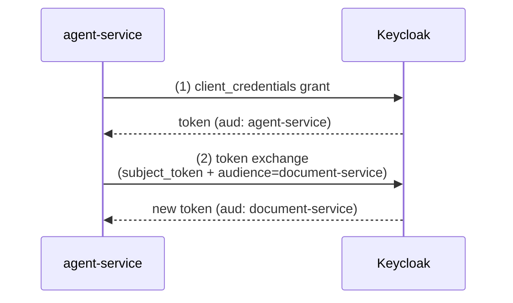
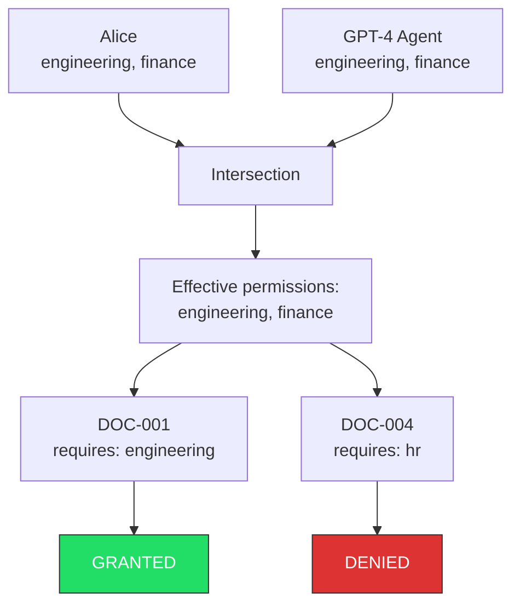
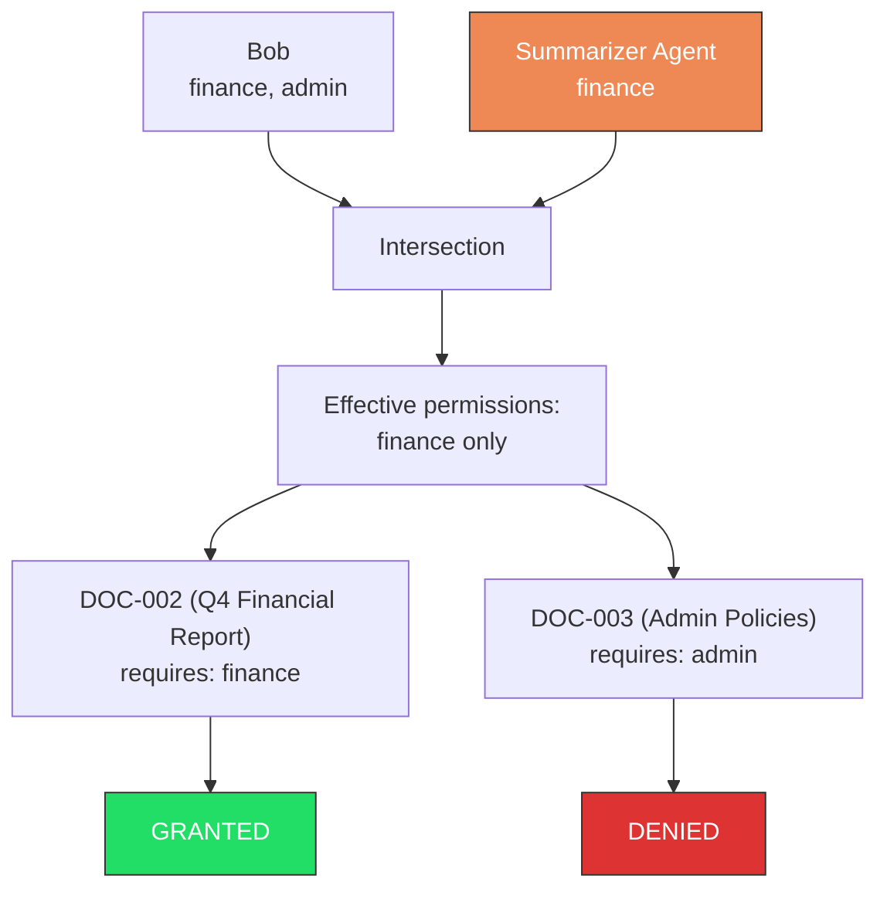
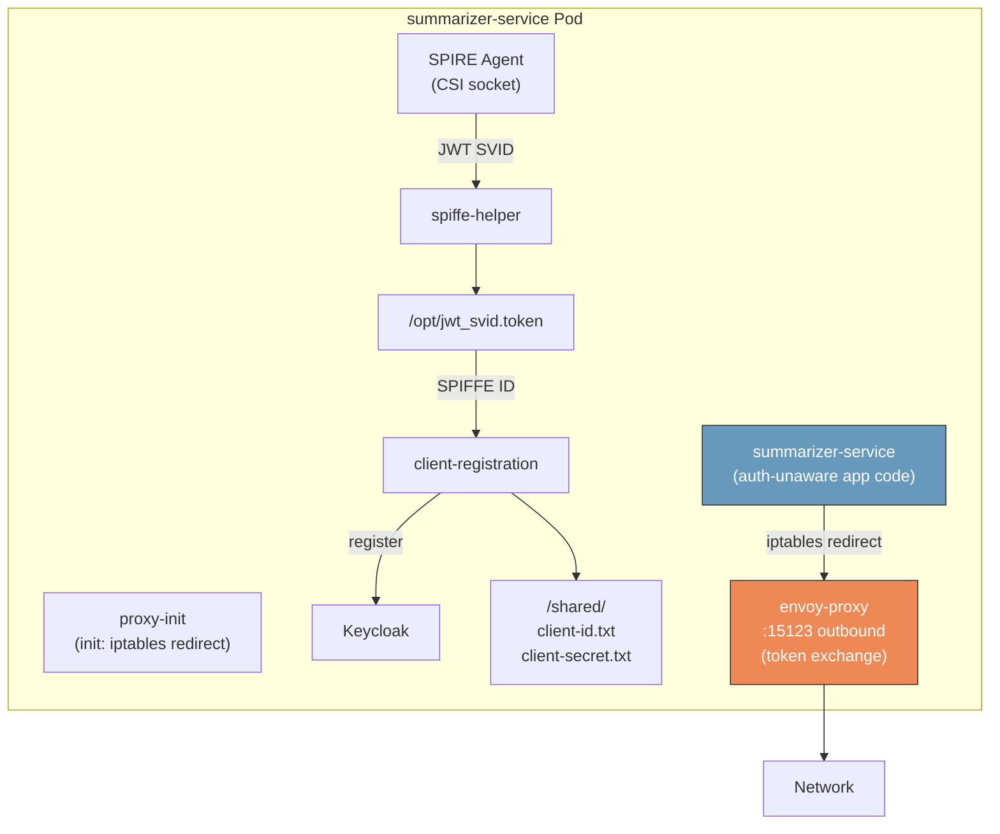
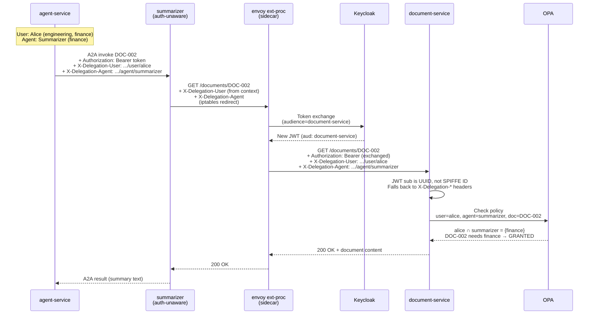
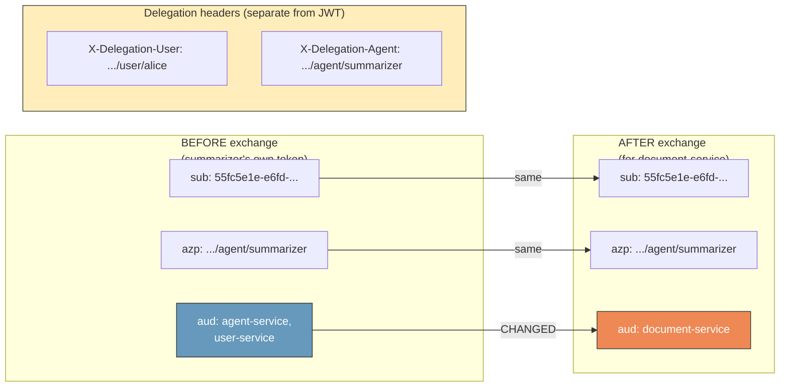
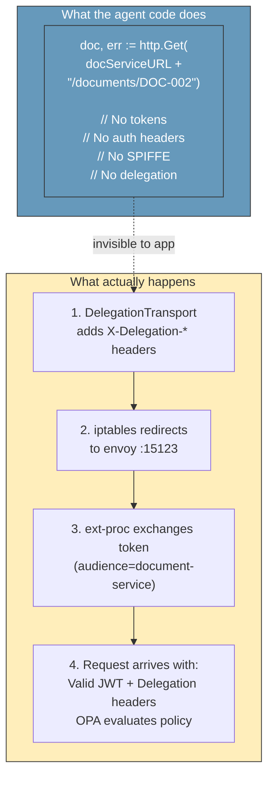

# AuthBridge flow diagrams

These diagrams illustrate the token exchange and delegation mechanisms
demonstrated by the AuthBridge test suite (`scripts/test-authbridge.sh`).

Each diagram is provided in both ASCII and Mermaid formats.

## Direct token exchange (Tests 1-3)

Basic client_credentials → token exchange flow without any agent chain.

```text
┌──────────────┐     (1) client_credentials      ┌──────────────┐
│              │ ──────────────────────────────▶ │              │
│ agent-service│     token (aud: agent-service)  │   Keycloak   │
│              │ ◀────────────────────────────── │              │
│              │                                 │              │
│              │  (2) token exchange             │              │
│              │    (subject_token + audience=   │              │
│              │     document-service)           │              │
│              │ ──────────────────────────────▶ │              │
│              │     new token (aud:             │              │
│              │      document-service)          │              │
│              │ ◀────────────────────────────── │              │
└──────────────┘                                 └──────────────┘
```



## OPA permission intersection (Tests 4-5)

Why DOC-001 is allowed but DOC-004 is denied.

```text
         Alice                    GPT-4 Agent
    ┌─────────────┐          ┌─────────────────┐
    │ engineering │          │  engineering    │
    │ finance     │          │  finance        │
    └──────┬──────┘          └────────┬────────┘
           │                          │
           └──────────┬───────────────┘
                      ▼
              ┌───────────────┐
              │  Intersection │
              │ ───────────── │
              │ engineering ✓ │
              │ finance     ✓ │
              └───────┬───────┘
                      │
         ┌────────────┴────────────┐
         ▼                         ▼
  ┌─────────────┐          ┌─────────────┐
  │   DOC-001   │          │   DOC-004   │
  │ engineering │          │     hr      │
  │             │          │             │
  │  GRANTED    │          │  DENIED     │
  └─────────────┘          └─────────────┘
```



## Agent capability restriction (Bob + Summarizer)

Why Bob is denied access to DOC-003 (Admin Policies) through the
Summarizer agent — even though Bob has admin permissions. The Summarizer
agent only has finance capabilities, so the intersection excludes admin.

```text
          Bob                    Summarizer Agent
    ┌─────────────┐          ┌─────────────────┐
    │ finance     │          │  finance        │
    │ admin       │          │                 │
    └──────┬──────┘          └────────┬────────┘
           │                          │
           └──────────┬───────────────┘
                      ▼
              ┌───────────────┐
              │  Intersection │
              │ ───────────── │
              │ finance     ✓ │
              │ admin       ✗ │
              └───────┬───────┘
                      │
         ┌────────────┴────────────┐
         ▼                         ▼
  ┌─────────────┐          ┌─────────────┐
  │   DOC-002   │          │   DOC-003   │
  │   finance   │          │    admin    │
  │             │          │             │
  │  GRANTED    │          │  DENIED     │
  └─────────────┘          └─────────────┘

  Bob has finance,           Bob has admin, but
  Summarizer has finance     Summarizer does NOT
  -> intersection includes   -> intersection excludes
     finance                    admin
```



## AuthBridge sidecar architecture (Test 6)

What's inside each AI agent pod.

```text
┌─ summarizer-service Pod ─────────────────────────────────┐
│                                                          │
│  ┌─────────────────┐   ┌──────────────────────────────┐  │
│  │   proxy-init    │   │  SPIRE Agent (CSI socket)    │  │
│  │  (init: iptables│   └──────────┬───────────────────┘  │
│  │   redirect)     │              │                      │
│  └─────────────────┘              │ JWT SVID             │
│                                   ▼                      │
│  ┌─────────────────┐   ┌──────────────────┐              │
│  │  spiffe-helper  │──▶│ /opt/jwt_svid    │              │
│  │                 │   │     .token       │              │
│  └─────────────────┘   └────────┬─────────┘              │
│                                 │                        │
│  ┌─────────────────┐            │ SPIFFE ID              │
│  │    client-      │◀───────────┘                        │
│  │  registration   │──▶ Keycloak (register client)       │
│  │                 │──▶ /shared/client-id.txt            │
│  │                 │──▶ /shared/client-secret.txt        │
│  └─────────────────┘                                     │
│                                                          │
│  ┌─────────────────┐   ┌──────────────────┐              │
│  │  summarizer-    │   │   envoy-proxy    │              │
│  │  service        │   │                  │              │
│  │  (app code -    │──▶│ outbound:15123   │──▶ network   │
│  │   auth-unaware) │   │  (token exchange)│              │
│  └─────────────────┘   └──────────────────┘              │
│         ▲                        ▲                       │
│         │    iptables redirect   │                       │
│         └────────────────────────┘                       │
└──────────────────────────────────────────────────────────┘
```



## A2A delegation flow end-to-end (Tests 8, 10, 12)

The full chain with header/token transformation at each hop.

```text
 User: Alice                    Agent: Summarizer
 Depts: engineering, finance    Caps: finance

 ┌────────────┐  POST /agents/summarizer/invoke
 │   agent-   │  + Bearer token
 │  service   │  + body: {doc: DOC-002, user: alice}
 └─────┬──────┘
       │
       │ A2A call with CallMeta headers:
       │   Authorization: Bearer <agent-svc-token>
       │   X-Delegation-User: spiffe://.../user/alice
       │   X-Delegation-Agent: spiffe://.../agent/summarizer
       ▼
 ┌────────────────────────────────────────────────┐
 │         summarizer-service Pod                 │
 │                                                │
 │  ┌──────────────┐                              │
 │  │ summarizer   │  GET /documents/DOC-002      │
 │  │ (auth-       │  + X-Delegation-User (from   │
 │  │  unaware)    │    context, via Transport)   │
 │  │              │  + X-Delegation-Agent        │
 │  └──────┬───────┘                              │
 │         │ iptables ──────────────┐             │
 │         ▼                       ▼              │
 │  ┌──────────────────────────────────────┐      │
 │  │          envoy ext-proc              │      │
 │  │                                      │      │
 │  │  1. Reads X-Delegation-* headers     │      │
 │  │  2. Exchanges token:                 │      │
 │  │     sub: <UUID> (unchanged)          │      │
 │  │     azp: .../agent/summarizer        │      │
 │  │     aud: agent-svc -> document-svc   │      │
 │  │  3. Replaces Authorization header    │      │
 │  │  4. Passes X-Delegation-* through    │      │
 │  └──────────────────┬───────────────────┘      │
 │                     │                          │
 └─────────────────────┼──────────────────────────┘
                       │
                       ▼
 ┌─────────────────────────────────────────┐
 │         document-service                │
 │                                         │
 │  1. Validates JWT (aud=document-service)│
 │  2. sub is UUID, not SPIFFE ID          │
 │     -> falls back to X-Delegation-*     │
 │  3. Calls OPA with:                     │
 │     user:  spiffe://.../user/alice      │
 │     agent: spiffe://.../agent/summarizer│
 │  4. OPA: alice ^ summarizer = {finance} │
 │     DOC-002 needs finance -> GRANTED    │
 └─────────────────────────────────────────┘
```



## Token claim transformation (Test 12)

Before/after view of the token exchange.

```text
        BEFORE exchange                    AFTER exchange
   (summarizer's own token)          (for document-service)
 ┌─────────────────────────┐     ┌─────────────────────────┐
 │                         │     │                         │
 │ sub: 55fc5e1e-e6fd-...  │ --> │ sub: 55fc5e1e-e6fd-...  │  same
 │                         │     │                         │
 │ azp: spiffe://...       │ --> │ azp: spiffe://...       │  same
 │      /agent/summarizer  │     │      /agent/summarizer  │
 │                         │     │                         │
 │ aud: agent-service,     │     │ aud: document-service   │  CHANGED
 │      user-service       │     │                         │
 │                         │     │                         │
 └─────────────────────────┘     └─────────────────────────┘

    Token identifies WHO              Token identifies WHO
    (summarizer) and its              (same) but grants access
    original audiences                to document-service

 ┌──────────────────────────────────────────────────────────┐
 │  Delegation travels ALONGSIDE the token, not inside it:  │
 │    X-Delegation-User:  spiffe://.../user/alice           │
 │    X-Delegation-Agent: spiffe://.../agent/summarizer     │
 └──────────────────────────────────────────────────────────┘
```



## What the agent code sees vs what actually happens

The "zero trust invisible" point — agent code is auth-unaware.

```text
  What the summarizer code does:        What actually happens:
 ┌──────────────────────────┐    ┌────────────────────────────────┐
 │                          │    │                                │
 │  doc, err := http.Get(   │    │  1. DelegationTransport adds   │
 │    docServiceURL +       │    │    X-Delegation-User header    │
 │    "/documents/DOC-002") │    │    X-Delegation-Agent header   │
 │                          │    │                                │
 │  // That's it.           │    │  2. iptables redirects to      │
 │  // No tokens.           │    │    envoy :15123                │
 │  // No auth headers.     │    │                                │
 │  // No SPIFFE.           │    │  3. ext-proc exchanges token   │
 │  // No delegation.       │    │    (client_credentials ->      │
 │                          │    │     document-service audience) │
 │                          │    │                                │
 │                          │    │  4. Request arrives at         │
 │                          │    │    document-service with:      │
 │                          │    │    - Valid JWT                 │
 │                          │    │    - Delegation headers        │
 │                          │    │    - OPA evaluates policy      │
 └──────────────────────────┘    └────────────────────────────────┘

         3 lines of Go               4 infrastructure layers
```


